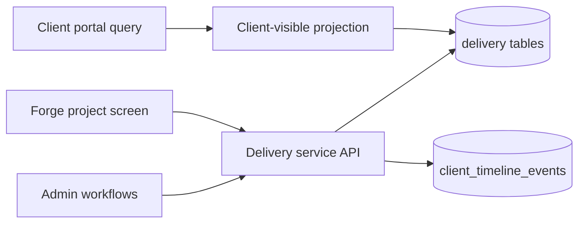
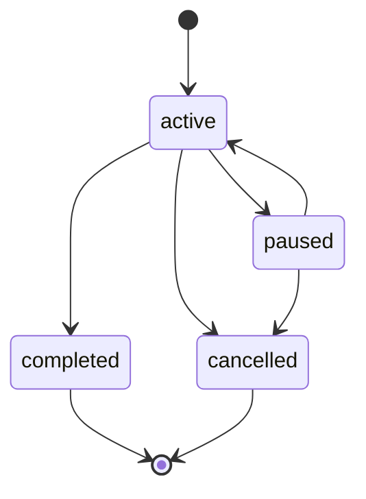

# Client projects and delivery

The delivery domain is the ScaleSmiths source of truth for client project progress. It remains inside the modular monolith and shares PostgreSQL with admin, the portal and Forge. Admin owns its schema and migrations; the portal has a deliberately reduced read projection; Forge consumes delivery's service API rather than editing delivery tables.

## Ownership

- `delivery_projects` owns project identity, client association, lifecycle, phase, assignee, target dates and optional Forge/deployment links.
- Milestones own progress. A skipped milestone is excluded; each completed milestone contributes its positive weight. With no published or internal milestones, progress is zero.
- Deliverables are concrete outputs and may reference a milestone. Services verify that nested identifiers belong to the same project.
- Resources are external HTTP(S) links or file references. They are not binary storage.
- Decisions represent approval or input required to move work forward.
- Audit logs are append-only service writes for material changes.

Internal notes, owner identities and audit metadata are absent from the web schema projection. Client visibility is explicit for projects, milestones, deliverables, resources and decisions. Project `summary` is client-facing; `internal_notes` is not. An unpublished project is never returned to the portal even if its client association is valid.

## Lifecycle

Completed and cancelled projects are terminal. Completion requires every non-skipped milestone to be complete. Milestones move from planned through active or blocked to completed/skipped and cannot be silently reopened. Decision resolution requires resolution text. The service sets completion timestamps in the same transaction as state changes.

## Public APIs

Admin route handlers expose authenticated `projects.read` and `projects.write` operations under `/api/projects`. The stable server API is `admin/src/lib/server/delivery-project-service.ts`; it owns validation, lifecycle transitions, client scoping, Forge/deployment linkage, timeline publication and audit writes.

The portal uses `web/src/lib/portal-projects.ts`. Its project query joins `delivery_projects.client_id` to the explicit `clients.portal_client_id` association and batches all child reads. It selects only client-visible children and never selects internal notes, assignees or audit records.

## Forge and deployment linkage

A delivery project can link to one Forge project and one of that Forge project's deployment candidates. The service rejects a Forge project belonging to another client and rejects a candidate outside the linked Forge project. Forge remains responsible for generation and release gates; delivery owns what that build means for client progress.

## Deliberate first-version limits

- No generic issue tracker, arbitrary workflow designer, time tracking, comments or dependency graph.
- No binary upload store; resources point to controlled file locations or links.
- No automatic milestone completion from Forge. Deployment linkage is explicit and audited; automation can be added later through this service boundary.
- No client mutation endpoint for decisions yet. Admin records the resolution after client confirmation through the existing communication workflow.
