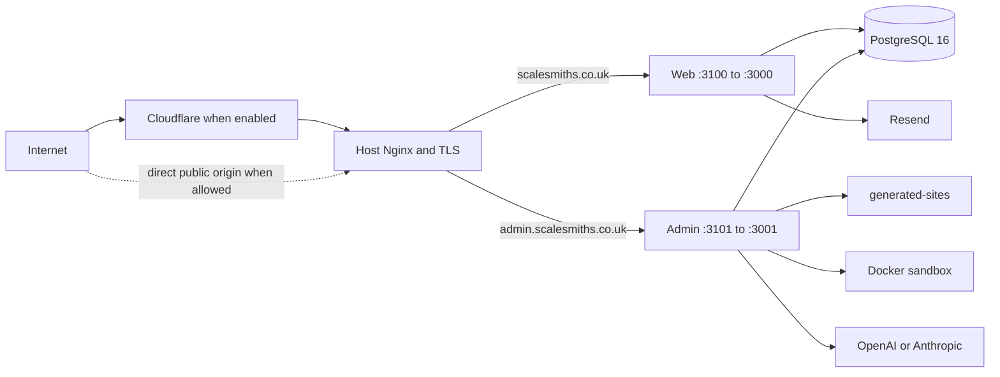

# Current ScaleSmiths architecture

**Baseline date:** 28 August 2026  
**Status:** Canonical current-state architecture baseline

This document is the authoritative high-level description of the implementation currently held in this repository. Executable configuration, schemas, migrations, policy checks, and application code remain the ultimate source of truth when they change. The detailed architecture documents linked below explain individual subsystems.

The [10 July system overview](system-overview.md), [13 July production-readiness audit](../audits/production-readiness-final.md), and [July dependency and CI security audit](../security/dependency-audit-2026-07.md) are retained as historical snapshots. Their findings were valid for their recorded revisions; this baseline records which conditions have since changed.

## 1. System purpose

ScaleSmiths is an agency operating platform with a public acquisition and client-facing application, a private administration application, and Forge, its private AI-assisted site-generation system. It supports lead capture, client operations, project delivery, reporting, finance/invoicing, and controlled generation and release of client websites.

## 2. Deployable applications

| Deployable | Location | Runtime responsibility |
| --- | --- | --- |
| Public web | `web/` | Marketing and service journeys, quote capture, consent/analytics collection, authenticated client portal, published reports and invoices |
| Admin | `admin/` | Internal CRM, client operations, RBAC, MFA, finance, invoicing, analytics, and the Forge user/API/worker surface |
| PostgreSQL | `postgres:16-alpine` in Compose | Shared durable relational store with separate runtime, migration, backup, and optional read-only principals |
| Nginx | host service in the canonical VPS topology | TLS termination, hostname routing, request limits, security headers, and optional Cloudflare-origin enforcement |

Web and admin are independently built Next.js 15 applications with separate dependency trees. The repository root is an orchestration and policy context, not an npm workspace and not a third application.

## 3. Modular-monolith boundaries

The current modular-monolith approach is intentional. Web and admin are separate deployables and security contexts, while related business capabilities remain modules within them and share one PostgreSQL database. This matches the current team size, operational topology, transaction needs, and deployment model.

Microservices are not currently justified. Splitting processes by domain would add distributed transactions, contract versioning, network failure modes, more credential surfaces, and additional release/observability burden without a demonstrated scaling or ownership constraint. A future extraction should require measured isolation, scaling, availability, or independent-team needs rather than architectural fashion.

Shared PostgreSQL does not mean unrestricted cross-domain data access. Runtime principals, grants, RLS where applicable, server-side authorization, schema ownership, and migration ownership define the permitted boundaries.

## 4. Main domains

- **Public acquisition:** marketing, service routing, quote/local-growth funnels, consent, public claims, and notifications.
- **Client portal:** client authentication, requests and threads, timeline, published monthly reports, and published immutable invoices/PDFs.
- **Identity and access:** internal users, Auth.js sessions, password security, MFA, session revocation, RBAC, and security audit records.
- **CRM and delivery:** clients, prospects, outreach, messages, requests, proposals, kanban, reports, and project state.
- **Finance:** invoice settings/catalogue, invoice drafting/issuance/voiding/payment/delivery, portal publication, document snapshots, and audit history.
- **Forge:** projects, workflows/runs, jobs, agents, artifacts, memories, AI usage/budgets, previews, QA, dependency admission, deployment candidates, and release gates.
- **Operations:** migrations, database roles, backup/restore, release switching, health checks, Nginx, monitoring adapters, and incident/recovery procedures.

## 5. Trust boundaries

The internet, portal users, quote submitters, provider responses, crawled sites, generated source, dependencies, and uploaded/generated artifacts are untrusted. Host Nginx is the first repository-defined origin boundary. Web public routes admit limited validated input; portal routes add the portal session/client boundary; admin routes add Auth.js identity, MFA policy, and RBAC; Forge adds structured-output, workspace, sandbox, budget, approval, and release boundaries.

Secrets remain server-side. Generated workspaces receive a deliberately small environment and no application database or AI-provider credentials. Backup tooling is a separate privileged operator boundary because it can read database and host recovery state.

See [Security boundaries](security-boundaries.md) and [Generated-code threat model](../security/generated-code-threat-model.md).

## 6. Authentication flows

### Portal authentication

The portal uses its own credentials flow rather than Auth.js. Active `portal_client_accounts` records hold a unique email, external text `client_id`, and bcrypt password hash. Successful login signs an eight-hour HS256 JWT with `PORTAL_SECRET` and stores it in the HTTP-only, SameSite=Lax, production-Secure `ss-client-session` cookie. Layouts, pages, and API handlers derive the client identity from the verified token and reject or redirect mismatched route client IDs. Login throttling is persisted. The environment-driven demo identity is opt-in and must remain disabled in production.

### Admin authentication and MFA

Admin uses the Auth.js v5 credentials provider with persistent `admin_users` and eight-hour JWT sessions. There is no public signup. Passwords are bcrypt hashes. The token contains role, active state, and `sessionVersion`; protected Node middleware reloads the current database user so account disablement or a version increment revokes existing sessions.

Privileged production identities require TOTP MFA outside a bounded bootstrap grace period. TOTP secrets are encrypted with AES-256-GCM using the dedicated MFA key. Recovery codes are salted scrypt hashes, consumed transactionally once, and never stored in plaintext. Enrolment, challenge failure, recovery use, reset, and disablement produce security audit events. See [Admin identity](../operations/admin-identity.md) and [Admin MFA](../operations/admin-mfa.md).

Auth.js remains on an explicitly time-limited v5 beta risk acceptance; it is not an undocumented exception.

## 7. Authorization model

`admin/src/lib/rbac.ts` is the central admin authorization policy. Roles are owner, administrator, sales, project manager, developer, finance, and viewer. Capabilities cover identity management, leads, clients, projects, Forge read/execute/approve/configure, finance, settings, audit, and deployment. Middleware maps paths and methods to capabilities; handlers and server actions add body/resource-sensitive guards. Navigation visibility is convenience, never the security boundary.

Owner-only identity operations and the final-active-owner invariant remain in the identity domain. Current internal business data has global-or-none admin scope because records do not carry per-admin ownership. Portal authorization is a separate client-ownership model, not an admin RBAC role. See [RBAC policy](rbac-policy.md).

## 8. Data ownership

Web owns migrations for public acquisition and portal-facing structures, including quote capture, portal accounts, client requests/threads/timeline, monthly reports, public experience data, and the public-claims boundary. Admin may read or update explicitly shared operational tables but that does not transfer migration ownership.

Admin owns internal identity, CRM, clients, delivery/kanban, sales proposals, analytics, finance/invoicing, and all Forge tables. Cross-application TypeScript declarations exist for some shared tables and require coordinated compatibility; there is not yet a common schema package.

The current histories contain 16 web migrations (`0000`–`0015`) and 51 admin migrations (`0000`–`0050`). Both target the same database but retain separate Drizzle journals. Web migrations must always be applied before admin migrations. Committed migration SQL and journal entries are checksum-locked; corrections are forward-only.

## 9. Database roles and principals

Production uses distinct credentials:

| Principal | Boundary |
| --- | --- |
| `WEB_DATABASE_URL` | Narrow grants for public/web-owned and explicitly shared portal operations; no CRM, identity, Forge, finance, private claim evidence, DDL, or journals |
| `ADMIN_DATABASE_URL` | Broad application DML required by the internal modular monolith; no DDL, role management, object ownership, or migration-journal writes |
| `MIGRATION_DATABASE_URL` | Schema/object owner used only by one-shot web-then-admin migration services |
| `POSTGRES_PROVISIONING_DATABASE_URL` | Operator-controlled superuser used only to provision/reconcile roles and grants |
| `BACKUP_DATABASE_URL` | Read-only backup role with the RLS bypass needed for complete dumps |
| `READONLY_DATABASE_URL` | Optional read-only operator role without general RLS bypass |

`DATABASE_URL` is a development/test compatibility fallback and production runtime resolution fails closed without the dedicated application variable. Long-running production containers explicitly blank unrelated database URLs. See [PostgreSQL access boundaries](database-access-boundaries.md).

## 10. Client isolation

Portal isolation is currently enforced in application queries using the verified external text `clientId`; portal resources are filtered by that identifier and internal-only thread messages are excluded. Client analytics and optimisation tables use forced PostgreSQL RLS with transaction-local `app.current_client_id`, preventing missing or cross-client contexts from reading or writing rows.

Portal/request/report client IDs are external text identifiers while admin CRM clients use integer primary keys, with an explicit unique portal identifier mapping on clients. General RLS for portal and Forge records remains deferred until this tenant identity is made canonical and legitimate internal aggregate access is designed. Therefore current portal isolation is strong application-level ownership enforcement, but not a general database tenant boundary.

## 11. Invoice and document immutability

Invoices are admin-owned financial records. Drafts and their items may be changed or deleted. Issuance occurs transactionally: the client sequence is allocated under concurrency controls; an immutable invoice number is derived from the permanent client code and sequence; supplier, customer, payment, item, totals, and template data are snapshotted; the PDF is generated and stored as bytes with a SHA-256 digest; and an audit event is appended.

Database uniqueness and lifecycle checks prohibit duplicate invoice numbers/client sequences and require complete document snapshots for every non-draft invoice. Issued records are not rewritten to reflect later client, supplier, catalogue, or template changes. Later lifecycle operations mark payment, void the invoice, deliver it, or explicitly publish/unpublish it to the mapped portal client. Portal reads require both ownership and publication and serve the stored PDF with private, no-store semantics. Database rollback must not be used to rewrite financial history.

## 12. Forge execution, sandbox, and release path

Forge is an admin domain, not a public application. Auth.js middleware and Forge RBAC capabilities protect its pages and APIs. Its workflow persists projects, runs, steps, tasks, jobs, artifacts, memories, approvals, usage/costs, and activity. AI is disabled by default and the mock provider is the default; live OpenAI/Anthropic execution requires explicit enablement, provider configuration, and database-authoritative budget reservations.

Queued work is durable in PostgreSQL. An in-process worker starts from admin instrumentation, atomically claims jobs using `FOR UPDATE SKIP LOCKED`, heartbeats a lease, retries with bounded backoff, reaps expired leases, and dead-letters exhausted work. Multiple admin replicas can coordinate safely at the queue level, but worker execution still shares the admin process and its broad runtime database role.

Generated workspaces live under ignored `generated-sites/` and are bind-mounted only into admin. Production defaults to the Docker sandbox: selected workspace only, non-root user, dropped capabilities, `no-new-privileges`, CPU/memory/PID constraints, secret-free environment, and no network for normal build/QA. Registry installs and previews can use separately configured bridge networking; this remains a controlled egress and shared-host-kernel risk. The local runner is a development convenience, not equivalent isolation.

Forge release uses immutable deployment candidates bound to workspace/artifact hashes, QA/security/accessibility evidence, dependency-policy results, exact lockfile analysis, and a per-site SPDX SBOM. Release gates and audited human approvals can mark readiness; they do not automatically deploy. Export/manual/VPS packages are operator-reviewed. The example GitHub generated-site workflow is deliberately build-only and a placeholder. See [Forge workflow](forge-workflow.md), [dependency admission](forge-dependency-admission.md), [deployment candidates](forge-deployment-candidates.md), and [release gates](forge-release-gates.md).

## 13. Deployment topology

The canonical production checkout is `/var/www/scalesmiths/ScaleSmiths`. The current production path is host-Nginx blue/green deployment: Nginx owns ports 80/443 and TLS, while inactive/active web and admin slots publish only loopback ports managed by `docker-compose.release.yml` and `scripts/release-manager.mjs`. The normal host-Nginx Compose topology maps web/admin to `127.0.0.1:3100/3101`. PostgreSQL uses a named volume; `generated-sites` is a private admin bind mount and is never an Nginx document root.

`scalesmiths.co.uk` serves web and `admin.scalesmiths.co.uk` serves admin. There is no supported path-based public `/admin` topology. Health checks, an atomic Nginx upstream include switch, observation, and application rollback retain the previous slot. Migrations are deliberately outside the traffic-switch transaction and must be backward-compatible with the retained application version.

The repository also retains container-Nginx production, development, integration-test, and Nginx-test Compose variants; these are not alternate claims about the current VPS release path. See [Deployment topology](deployment-topology.md) and the [release runbook](../operations/release-runbook.md).

### Cloudflare assumptions

Cloudflare Access and origin restriction are the intended defence-in-depth boundary for the admin hostname. The repository provides a reviewed Cloudflare-specific Nginx configuration, automated Cloudflare range generation, trusted-peer real-IP handling, and tests preventing spoofed forwarding headers. The generic host configuration contains an explicit replacement point rather than proving Cloudflare is active. DNS proxy state, Access policies, origin firewall rules, range-refresh scheduling, and Authenticated Origin Pulls are external configuration and require production evidence. The public hostname must remain reachable under the chosen shared-origin firewall design.

## 14. Backup and restore

The backup framework creates encrypted, integrity-marked recovery bundles containing a PostgreSQL custom dump, protected environment and Nginx state, generated workspaces, release state, migration journals/checksums, and image identifiers. It supports age or GPG encryption, off-host upload, retention tiers, locking, pruning, and root-owned systemd schedules. Default policy is daily backup, 24-hour RPO, 60-minute RTO, and monthly isolated restore drills.

Restore is deliberately destructive only to an explicitly named isolated target carrying a fixed database comment and multiple confirmations. It verifies archive structure, checksums, database contents, both migration journals, and evidence output. CI/Docker tests establish framework behaviour; only an authorised restore of a production-derived bundle can establish actual recoverability and achieved RPO/RTO. No repository script automatically replaces production. See [Backup and restore](../operations/backup-and-restore.md).

## 15. CI and security pipeline

GitHub Actions provides stable CI, Security, and CodeQL workflows for pull requests to `master`, pushes, schedules where appropriate, and manual runs. Current gates include:

- web lint, unit tests, production build, performance budgets, Chromium journeys/visual baselines, and Firefox/WebKit smoke coverage;
- admin lint, unit tests, Forge benchmarks, production build, authenticated Forge E2E, and PostgreSQL integration/migration paths;
- root environment, dependency, architecture, migration-history, topology, GitHub Actions, documentation, release-simulation, and PR metadata policy checks;
- dependency review, full-history verified-secret scanning, production npm audit thresholds, Dockerfile linting, Trivy image scanning, application-image SBOMs, generated-site sandbox fixtures, and CodeQL extended queries;
- disposable Nginx configuration and request-level topology tests, including Cloudflare source-IP trust behaviour.

These are merge/release evidence, not production deployment approval. GitHub enforcement still depends on the repository ruleset/branch-protection configuration described in [protected areas and branch protection](../operations/protected-areas-and-branch-protection.md).

## 16. External providers

| Provider/system | Current relationship |
| --- | --- |
| Resend | Server-side quote/request notification delivery; generated sites may reference an environment-owned key at their own deployment target |
| OpenAI and Anthropic | Optional Forge structured-output providers behind explicit enablement, adapter, health/failover, budget, and audit controls |
| Sentry-compatible monitoring | Repository adapters and source-map/build configuration exist; production activation and privacy alignment require operational evidence |
| Cloudflare | Intended admin Access/origin boundary and trusted client-IP source; externally configured |
| Let's Encrypt/TLS | Referenced by host Nginx certificate paths and managed at host level |
| Off-host backup storage | Operator-configured through rclone with separate credentials and recommended object lock |
| WhatsApp | Current Forge V1 produces `wa.me` behaviour; Cloud API variables are future-facing |
| Cloudflare R2 | Environment contract exists for future storage work; it is not the current general document store |

## 17. Current residual risks

The authoritative finding-by-finding status, evidence, action, and remaining work are maintained in the [current residual-risk register](residual-risk-register.md). The following is a summary of current risks or unverified operational controls, not a claim that completed repository mechanisms are absent:

1. Strict `master` protection and GitHub-native secret/security settings require live repository configuration and verification.
2. Historical `.freebuff/` desktop state remains in reachable Git history until a coordinated rewrite.
3. Production-derived restore evidence and achieved RPO/RTO remain human operational gates.
4. Monitoring/log-shipping activation, alert routing, and privacy/subprocessor alignment require production evidence.
5. Portal text identity and admin integer client identity prevent a uniform RLS tenant model; most portal/Forge isolation remains application-enforced.
6. Forge outbound URL validation still needs a connection-pinned or equivalent design to fully close DNS-rebinding risk.
7. Auth.js v5 beta and the development-only Drizzle Kit advisory chain remain time-bounded dependency risks.
8. Forge Docker execution shares the host kernel, and bridge-enabled install/preview operations rely on host egress controls.
9. The Forge worker is in-process and uses the broad admin runtime role; operational visibility, retention, and dedicated-worker isolation remain improvement areas.
10. Shared table declarations, client-request triage rules, and string-keyed Forge artifact/memory contracts can drift.
11. Admin component/accessibility coverage and authenticated portal lifecycle E2E coverage are incomplete.
12. Cloudflare, backup timers/off-host object lock, monitoring, and external post-release smoke monitoring cannot be confirmed from repository state alone.
13. Invoice immutability is strong after issue, but retention, recovery, and any correction/credit-note policy remain operational/business controls that must preserve the immutable record.

The actionable backlog is grouped in the [engineering roadmap](../engineering-roadmap.md).

## 18. Retired historical risks

Relative to the July snapshots, the current repository has retired or materially changed these findings:

- Forge dependency admission is candidate-bound, fail-closed, lockfile-derived, vulnerability-aware, and emits an SPDX SBOM.
- Web/admin production dependency audits were brought to zero known findings at the recorded July evidence point; remaining accepted findings are development-only and must still be rechecked over time.
- Migration histories are checksum-locked, historical reconciliation is forward-only, and clean/upgrade consistency paths are automated.
- Production database runtime and migration credentials are separated; grants and selected analytics RLS are executable policy.
- Forge jobs, rate limits/budgets, run state, approvals, previews, and release evidence are durable rather than purely process-memory placeholders. The worker itself remains in-process.
- Forge has deterministic authenticated E2E journeys and durable lease/recovery coverage.
- Host-Nginx routing, headers, unknown-host handling, generated-site refusal, and Cloudflare trust behaviour have a disposable request-level test harness.
- Backup creation, encryption, validation, guarded restore, retention, timers, and synthetic drills exist. Real production-derived recovery proof remains open.
- Finance now includes transactional invoice issuance, immutable snapshots/PDFs, audited lifecycle changes, delivery operations, and ownership-checked portal publication.

Historical documents are not edited to erase their original findings. Their banners and follow-up notes should direct readers here for the current baseline.

## 19. Decisions not to revisit casually

- Keep two independently built Next.js deployables with Forge inside private admin.
- Keep the modular monolith; require evidence before introducing services.
- Keep shared PostgreSQL with explicit domain, role, grant, and migration ownership boundaries.
- Apply web migrations before admin migrations and never edit committed migration history.
- Keep production runtime credentials separate from migration/provisioning/backup credentials.
- Keep admin without public signup; preserve MFA, session revocation, central RBAC, and final-owner invariants.
- Keep portal ownership derived from the authenticated account, never email/name guessing or client-controlled identifiers.
- Keep issued invoice snapshots and documents immutable; correct forward through an audited financial lifecycle.
- Keep generated sites private, secret-free, path-contained, sandboxed, dependency-admitted, and gated by human approval before release.
- Keep `generated-sites/` out of Git and out of Nginx public roots.
- Keep host-Nginx hostname separation and the canonical `/var/www/scalesmiths/ScaleSmiths` production root until an explicit topology migration is approved.
- Keep backup restore and production deployment as human-authorised operations with evidence; green CI alone is not approval.

These decisions are also represented by the [ADR index](../adr/README.md).

## 20. Recommended domain boundaries going forward

Strengthen the modular monolith before considering extraction:

The current ownership map, dependency rules, implemented dashboard read boundaries, and deliberately retained exceptions are recorded in [Domain ownership](domain-ownership.md).

1. Establish a canonical tenant identity mapping shared by portal, CRM, analytics, reports, invoices, requests, and Forge, then extend RLS only where the access model is explicit.
2. Create a narrow shared-contract package or generated compatibility boundary for genuinely shared tables/enums; keep each domain's migration ownership explicit.
3. Keep identity/RBAC, finance, portal, and Forge as separately testable server modules with route handlers acting as adapters.
4. Replace stringly typed Forge memory/artifact dependencies with versioned typed contracts and explicit lineage.
5. Separate the Forge worker process and database principal only when operational isolation is implemented end to end; this is a process boundary, not a mandate for a network microservice.
6. Introduce a dedicated document-storage boundary only when portal asset publication requires it; do not overload generated workspaces or invoice bytes as a general file store.
7. Preserve append-oriented audit/provenance records and design retention per domain rather than applying one global deletion rule.
8. Add contract, authorization, and lifecycle tests at boundaries before adding new deployables.
