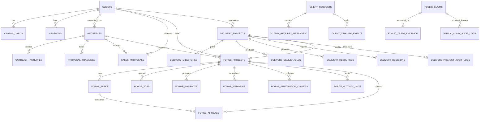

# Data model

PostgreSQL is shared by web and admin, but production uses separate `WEB_DATABASE_URL`, `ADMIN_DATABASE_URL`, and `MIGRATION_DATABASE_URL` principals. `DATABASE_URL` is a local/test compatibility fallback only. Drizzle definitions live in `web/src/lib/schema.ts` and `admin/src/lib/schema.ts`; migrations live in `web/drizzle` and `admin/drizzle`. There is no common schema package. See [PostgreSQL access boundaries](database-access-boundaries.md).

## Domain map

## Public/shared operational tables

| Table | Purpose | Ownership notes |
| --- | --- | --- |
| `quote_requests` | Quote and local-growth leads, source/funnel, requested intent, optional phone, qualification fields, consent, delivery state, status | Written by web; read/managed by admin |
| `quote_rate_limits` | Persistent quote throttle | Declared only by web |
| `portal_client_accounts` | Portal client ID, email, bcrypt hash, active state | Declared only by web |
| `login_rate_limits` | Persistent login throttles | Declared by both apps |
| `client_requests` | Portal support/change requests and Forge triage fields | Written by both apps |
| `client_request_messages` | Client/admin/system thread, with visibility | Written/read by both apps |
| `client_timeline_events` | Client-visible/internal operational timeline | Written/read by both apps; `project_id` is not a foreign key |
| `monthly_reports` | Draft/published HTML reports and period metadata | Managed by admin; published records read by portal |
| `public_claims` | Exact commercial/testimonial wording, review state, attribution, expiry and placement permissions | Managed by admin; never granted to web runtime |
| `public_claim_evidence` | Private evidence description/reference separated from public wording | Admin-only; never selected into the public view |
| `public_claim_audit_logs` | Actor/status/reason history for claim reviews | Admin-only append activity |
| `public_verified_claims` | Restricted public-safe view of evidenced, verified and unexpired claims | Web receives `SELECT`; contains no evidence reference or verifier ID |

Shared tables are duplicated in TypeScript rather than imported from one package. Schema compatibility depends on manual coordination of migrations.

## Admin CRM and delivery tables

- `admin_users`: internal UUID identity, case-insensitive unique email, display name, bcrypt hash, role, active/MFA state, login/password timestamps, and session revocation version.
- `admin_security_audit`: actor/target identity, security action, outcome, safe metadata, and timestamp for MFA/security events.
- `clients`: agency clients, contact/tier/MRR/status/progress.
- `kanban_cards`: delivery roadmap cards with client FK, column and position.
- `messages`: basic inbound/outbound client message records; separate from threaded client request messages.
- `prospects`: source/stage/priority, value estimates, audit scores, notes, follow-up and conversion timestamps.
- `outreach_activities`: typed communications/notes for a prospect.
- `proposal_trackings`: commercial package/status/timestamps for a prospect.
- `sales_proposals`: rendered HTML proposal, prices, selected services and prospect/client association.
- `delivery_projects`: client-owned delivery identity, lifecycle, phase, ownership, dates, and optional validated Forge/deployment linkage. Multiple projects may belong to one client.
- `delivery_milestones`: weighted delivery checkpoints. Non-skipped milestone weights are the source of overall progress; client visibility and internal notes are separate.
- `delivery_deliverables`: concrete project outputs, optionally grouped under a milestone, with workflow state, ownership, target date, and visibility.
- `delivery_resources`: HTTP(S) file/link references with explicit internal or client-visible publication state.
- `delivery_decisions`: open/resolved/cancelled choices required from a named party; client visibility is explicit and resolution is lifecycle-validated.
- `delivery_project_audit_logs`: append-only material project, milestone, deliverable, resource and decision changes.

## Forge tables

| Table | Role |
| --- | --- |
| `forge_projects` | Project identity, CRM links, status, priority, owner and brief summary |
| `forge_tasks` | Agent execution record with structured input/output and error/timestamps |
| `forge_jobs` | Queue item with kind, payload/result, status, attempts and claim timestamps |
| `forge_artifacts` | Versioned typed content and metadata with retention/size fields |
| `forge_integration_configs` | Per-project non-secret integration configuration |
| `forge_activity_logs` | Append-oriented actor/action/message audit trail |
| `forge_memories` | Key/value JSON-like state for workspace, preview, command chat and stage context |
| `forge_ai_usage` | Provider/model/token/cost/timing record linked to project/task where available |
| `forge_deployment_candidates` | Immutable workspace/artifact snapshot with generated-site dependency report, SPDX SBOM, policy/version/timestamp and manifest/lock/report/SBOM hashes |
| `forge_release_gate_decisions` | Candidate-specific manual approvals, revocations and only the explicitly permitted owner overrides |

Project deletion cascades to these Forge children. Client/prospect links are set null. Most cross-artifact dependencies are logical conventions in JSON metadata, not relational constraints.

## Enums and state

Important enums define quote status, request category/priority/status, message visibility, report status, CRM stages, proposal status, Forge project/task states, agent types, artifact types, and integration providers. Migration changes to a shared enum affect both applications even when introduced from only one migration history.

## Migration inventory

- Web migrations `0000`-`0015` build quote capture, portal accounts/rate limits, request threads/timeline and notification reconciliation, reports, public experience analytics, the public claims registry/restricted view, enquiry intent, and the local-growth funnel classification.
- Admin migrations `0000`-`0051` build operational CRM, identity/security, Forge workflow/provenance/economics, durable operational controls and run orchestration, client operations, analytics, finance/invoicing, release gates, the forward-only historical-schema reconciliation, generated-site dependency/SBOM evidence binding, and the client projects/delivery domain.

The histories are independent. Their Drizzle journals do not provide a single global order, despite targeting the same database. Deployment compensates by always running web then admin migrations.

Every migration is SHA-256 locked in `scripts/migration-checksums.json`. Historical journal prefixes are verified against proven Git commits, while new forward migrations and journal appends are recorded separately. The clean and historical-upgrade PostgreSQL paths are exercised independently. See `docs/operations/migration-history-and-backup-verification.md`.

## Integrity and lifecycle gaps

- `client_requests.client_id`, reports, and timeline client IDs are text identifiers without an FK to admin `clients`; portal identity and admin integer client identity are separate concepts.
- `client_timeline_events.project_id` is a logical delivery-project reference rather than a foreign key because the timeline table is web-migration-owned. Delivery services alone publish project events into it.
- Forge memories are flexible strings with application-validated JSON; the database cannot enforce value schemas or unique semantic keys unless migrations add constraints not represented as relations.
- Artifact consumers depend on title/type/metadata conventions and can read stale or incompatible records if those conventions drift.
- HTML report/proposal content is persisted; safe rendering depends on trusted generator/admin inputs and rendering discipline.
- Production-backup compatibility remains an operational evidence requirement: the guarded verifier exists, but an authorised operator must run it against an isolated restore of the latest verified backup.
