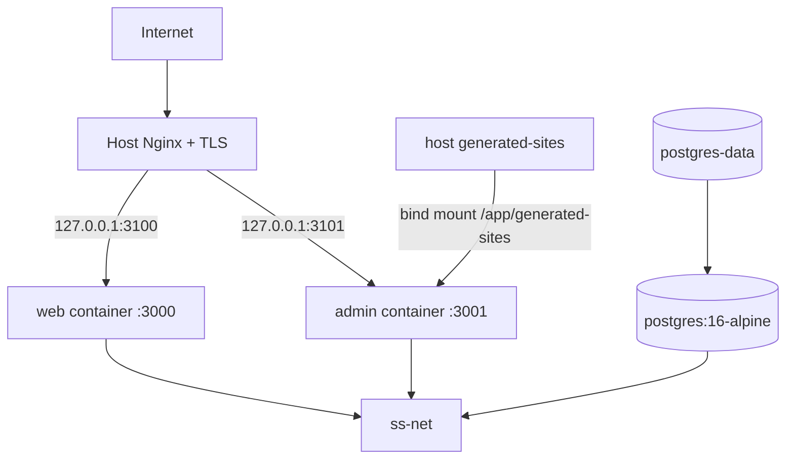

# Deployment topology

The authoritative production checkout is `/var/www/scalesmiths/ScaleSmiths`. Production commands, `.env`, release tooling and the private generated-workspace bind mount are resolved from this checkout unless an explicitly documented host-state path such as `/var/lib/scalesmiths-release` or `/etc/nginx` is involved.

## Supported Compose variants

| File | Purpose | Published ports |
| --- | --- | --- |
| `docker-compose.dev.yml` | Local development, hot-mounted `src` and `public` | web 3000, admin 3001, PostgreSQL 5432 |
| `docker-compose.yml` | Production with container-owned Nginx | Nginx 80/443; apps internal only |
| `docker-compose.host-nginx.yml` | Production behind an existing host Nginx | `127.0.0.1:3100` and `127.0.0.1:3101` |

The host-Nginx topology is the documented current VPS choice when another service already owns ports 80/443. `nginx/host-scalesmiths.conf` terminates TLS and proxies by hostname. The default Compose topology instead runs `nginx/nginx.conf` inside the Compose network.

Manual blue/green releases use `docker-compose.release.yml` and the two loopback port pairs documented in `docs/operations/canary-release-and-rollback.md`. Host Nginx resolves named web/admin upstreams from `/etc/nginx/scalesmiths/upstreams.conf`; the release manager changes that include atomically only after inactive containers pass health checks. PostgreSQL, generated workspaces and TLS remain owned by the existing topology.

## Images and migrations

Both production Dockerfiles build Next.js standalone runners on Node 22 Alpine and run as UID/GID 1001. Admin explicitly enables standalone output during its Linux builder stage. The host-Nginx Compose file also exposes builder-target `web-migrate` and `admin-migrate` services under the `tools` profile.

Required production order:

1. Start healthy PostgreSQL.
2. Run web migrations.
3. Run admin migrations.
4. Build/start web and admin.
5. Verify loopback endpoints, Nginx configuration, HTTPS hosts, and logs.

This order is operationally significant because both migration histories target one database and overlap on shared tables/enums.

Committed SQL and each journal's historical prefix are immutable under `scripts/migration-checksums.json`; corrective work is forward-only. Before a production migration, use `docs/operations/migration-history-and-backup-verification.md` to test an isolated restore of the latest verified production backup. The verifier never selects a database from the environment and does not authorise deployment.

## Nginx routing

- `scalesmiths.co.uk` and `www.scalesmiths.co.uk` redirect/terminate at the public host and proxy to web.
- `admin.scalesmiths.co.uk` proxies to admin; optional IP allowlist directives are present but commented.
- An optional Forge hostname example proxies to the same authenticated admin service, never to a workspace.
- Host configuration forwards client IP and protocol headers; the container configuration is simpler and does not currently forward the full equivalent header set.

## Persistent state

| State | Persistence |
| --- | --- |
| Business/Forge data | named PostgreSQL volume |
| Generated workspaces | host `/var/www/scalesmiths/ScaleSmiths/generated-sites`, bind-mounted to `/app/generated-sites` in admin |
| Preview processes/containers | runtime state; metadata persisted in `forge_memories` |
| Application images | rebuilt from `web/` and `admin/` contexts |
| Secrets | root `.env`, excluded from source control and supplied to services |

Encrypted recovery bundles include PostgreSQL, production environment configuration, reviewed host Nginx paths, `generated-sites`, release metadata, both migration journals, image digests, and key-ownership metadata without plaintext keys. Creation and retention run under example systemd timers; restoration is restricted to explicitly confirmed isolated targets and produces human-reviewed evidence. See `docs/operations/backup-and-restore.md`. Nginx must not serve the workspace directory.

## Environment variable ownership

The root `.env` is supplied wholesale to Compose services. Ownership below describes which subsystem should read each value, not process-level isolation.

| Owner | Variables |
| --- | --- |
| PostgreSQL/Drizzle | `POSTGRES_DB`, `POSTGRES_USER`, `POSTGRES_PASSWORD`, `DATABASE_URL` |
| Public web | `NEXT_PUBLIC_SITE_URL`, `PORTAL_SECRET`, `DEMO_PORTAL_ENABLED`, `DEMO_PORTAL_EMAIL`, `DEMO_PORTAL_PASSWORD`, `DEMO_PORTAL_CLIENT_ID` |
| Admin/Auth.js | `NEXT_PUBLIC_ADMIN_URL=https://admin.scalesmiths.co.uk`, optional server-only `AUTH_URL=https://admin.scalesmiths.co.uk`, `AUTH_SECRET` (or compatibility `NEXTAUTH_SECRET`), `ADMIN_EMAIL`, `ADMIN_PASSWORD` |
| Web email | `RESEND_API_KEY`, `RESEND_FROM`, `SUPPORT_EMAIL`, `ADMIN_PORTAL_URL`; Forge-generated server routes may also reference `RESEND_API_KEY` at their eventual deployment target |
| Server error monitoring | `ERROR_MONITORING_PROVIDER`, `ERROR_MONITORING_DSN`, `ERROR_MONITORING_RELEASE`, `ERROR_MONITORING_ENVIRONMENT`, `ERROR_MONITORING_SAMPLE_RATE` |
| Forge provider routing | `FORGE_ENABLE_AI`, `FORGE_DEFAULT_AI_PROVIDER`, `OPENAI_API_KEY`, `ANTHROPIC_API_KEY` |
| Forge token/cost controls | `FORGE_AI_MAX_TOKENS_PER_TASK`, `FORGE_AI_DAILY_TOKEN_BUDGET`, `FORGE_AI_DAILY_USD_BUDGET`, `FORGE_MAX_PROJECT_AI_COST`, `FORGE_MAX_MONTHLY_AI_COST` |
| Forge jobs/rate limits | `FORGE_JOBS_MODE`, `FORGE_RATE_LIMIT_WINDOW_MS`, `FORGE_MUTATION_RATE_LIMIT`, `FORGE_TASK_RATE_LIMIT` |
| Forge workspace/QA | `FORGE_MAX_REPAIR_ATTEMPTS`, `FORGE_ARTIFACT_MAX_VERSIONS`, `FORGE_ARTIFACT_MAX_CONTENT_BYTES`, `FORGE_QA_LOG_MAX_CHARS`, Lighthouse/console threshold variables |
| Forge preview/sandbox | `FORGE_PREVIEW_HOST`, `FORGE_PREVIEW_PORT_BASE`, `FORGE_ALLOW_PUBLIC_PREVIEWS`, all `FORGE_SANDBOX_*` variables |
| Future/external integrations | `WHATSAPP_*`, `R2_*`; these are documented/configurable but are not general browser credentials |

Only `NEXT_PUBLIC_SITE_URL` and `NEXT_PUBLIC_ADMIN_URL` are intended for client bundles. Provider, authentication, database, email, WhatsApp, and storage credentials are server-only. The environment hygiene check prevents real `.env*` files from entering the Git/archive surface, but does not validate secret strength or runtime completeness.

## CI topology

GitHub Actions runs on pushes and pull requests to `master`:

- web: Node 22, `npm ci`, lint, Vitest, production build;
- web browser gates: Chromium journeys and desktop/tablet/mobile visual baselines, plus focused Firefox/WebKit functional smoke coverage;
- admin: Node 22, `npm ci`, lint, Vitest, deterministic Forge benchmark, production build;
- database: both migration journals and a real empty-PostgreSQL integration suite;
- root hygiene: environment, architecture, dependency, topology and workflow-policy checks plus release/rollback simulation;
- security: dependency review, TruffleHog, npm production audits, Hadolint, Trivy, application-image SBOMs, sandbox fixtures and CodeQL.

CI builds and scans both application images, starts disposable PostgreSQL, applies both migration histories through the integration suite, and exercises public browser flows. The harmless release simulation covers atomic switching and rollback logic without deploying. Compose/Nginx request routing and a real production release remain operational checks rather than claims made by CI.

## Operational risks and documentation drift

- `docker-compose.yml` has no explicit migration services/order, while the host-Nginx file does; operators must follow the README migration instructions.
- Dev service names/images can survive a repository move with stale bind mounts; recreate containers after moving the checkout.
- The background Forge worker is not a dedicated Compose service. A caller/scheduler must invoke the authenticated worker route when jobs run in background mode.
- Preview port allocation and process/container lifecycle occur inside admin and need host Docker/process permissions appropriate to the selected runner.
- Container-owned and host-Nginx configurations have slightly different forwarded headers and security-header details.
