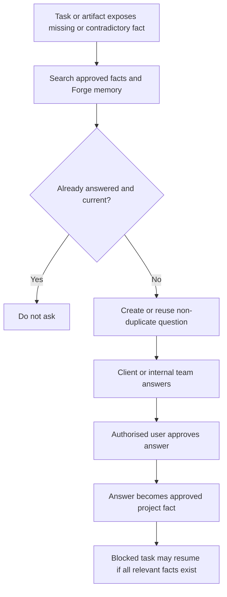

# Forge Human Clarification Queue

Forge now has a structured clarification queue for cases where continuing would require guessing a client fact.

## Purpose

The queue is used when approved intake, memory, or artifacts leave a required fact missing, contradictory, time-sensitive, or unsupported. It is intentionally narrow: Forge may ask precise questions, but it does not answer them, invent client facts, or resume blocked work until relevant approved facts exist.

Example question categories:

- `service_area`: postcode areas, towns, regions served
- `credential`: accreditations, licences, memberships
- `contact`: authoritative phone numbers or contact details
- `pricing`: public pricing versus quote-only positioning
- `testimonial`: publication permission
- `compliance`: unsupported claims, guarantees, awards, years of experience
- `business_fact` and `content`: general client facts

## Data Model

`forge_clarification_questions` stores each precise question with:

- linked project, task, and artifact where available
- normalized `fact_key`
- category, urgency, assignee, status, and group key
- source evidence and provenance
- answer, answerer, approver, approval timestamp
- expiry and revalidation timestamps for time-sensitive facts

`forge_project_facts` stores approved answers as durable project facts with:

- normalized key and approved value
- source question, task, artifact, answerer, and approver
- expiry and revalidation metadata
- provenance JSON including the clarification system version

## Flow

## API

`GET /api/forge/projects/:id/clarifications`

Synchronises the queue from current tasks, artifacts, Forge memory, and approved facts, then returns questions and facts.

`POST /api/forge/projects/:id/clarifications`

Records an answer. By default the answer is approved immediately by the authenticated internal user and stored as an approved project fact. Passing `approve: false` records an answer without making it authoritative.

The queue never launches downstream work automatically. A later workflow action must still pass the central Forge state machine and approval rules.

## Safety Rules

- Questions are generated only from explicit missing, contradictory, or unsupported-fact evidence.
- Existing approved facts and Forge memory are checked before asking.
- Open questions suppress duplicates for the same task and fact key.
- Expired or revalidation-due facts may be asked again.
- Answers preserve who answered and who approved them.
- Time-sensitive facts can carry `expiresAt` or `revalidateAfter`.
- Client-specific facts remain scoped to the Forge project.
