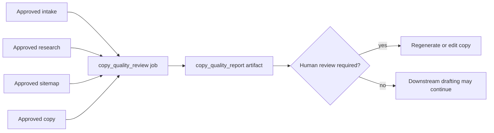

# Forge copy-quality evaluator

Forge can run a copy-specific quality review through `POST /api/forge/projects/:id/copy-quality`. The queued `copy_quality_review` job reads the latest approved copy, approved intake facts, approved research, and sitemap context, then stores a versioned `copy_quality_report` artifact.

The evaluator is deterministic in this version. It checks for generic AI language, empty superlatives, repetitive structures, excessive em dashes, unsupported claims, vague CTAs, missing geographic relevance, missing service specificity, competitor-generic phrases, repetition, weak evidence, missing objections, unclear next steps, long introductions, keyword stuffing, and unnatural local SEO copy.

The report returns specificity, brand-fit, conversion, evidence, readability, and repetition scores, plus high-risk claims, exact evidence, suggested revisions, and whether human review is required. Suggested revisions are constrained: they may remove, qualify, or request evidence for claims, but must not fabricate testimonials, statistics, accreditations, years of experience, insurance status, guarantees, or client facts.

## Source of truth

The source of truth is the approved project state:

- `handover_doc` for intake and approved business facts.
- `research_report` for customer concerns, market evidence, and approved proof.
- `sitemap` for page intent and conversion path.
- `copy_doc` for the approved copy under review.

The evaluator records those upstream artifact IDs and hashes through artifact provenance. If approved facts are missing, it reports that gap instead of filling it with invented proof.

## Artifact lifecycle

Critical unsupported claims block publication until a human approves a correction or supplies verified evidence.
