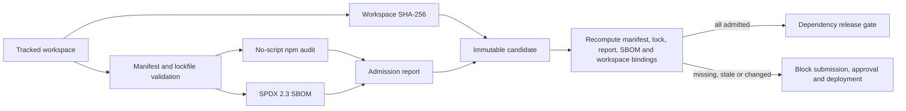

# Forge generated-site dependency admission

Forge treats each generated client site as an independent software supply-chain boundary. This system is separate from the SBOMs produced for the ScaleSmiths web and admin container images.

## Policy and evidence

The source-controlled registry in `admin/src/lib/forge-dependency-policy.ts` retains every policy version. A policy defines the direct-package allowlist and requested/resolved version bounds, blocked packages, approved npm registry origins, licence allow/deny lists, reviewed native packages, lifecycle-script rules, review-age warnings, evidence lifetime, package-count limit, and vulnerability thresholds. Historical versions must remain in the registry; changing a policy creates a new version.

Only a single root `package.json` and `package-lock.json` are supported by the generated-site workspace contract. Nested package graphs are rejected rather than silently skipped. Direct Git, file, workspace, link and arbitrary tarball specifications are prohibited. Registry tarball URLs are accepted only when their HTTPS origin is allowlisted. Transitive packages must be reachable from an approved direct dependency, match an explicitly reviewed name and exact version in the policy, and independently pass source, licence, vulnerability, lifecycle and native-binary checks. Trust is never inherited merely from a parent package name.

Candidate creation performs `npm audit --package-lock-only --ignore-scripts --json` using the configured Forge runner and its install network. Production therefore uses the hardened Docker runner. Audit startup, network, timeout or JSON failures become blocking evidence; the application never treats an unavailable audit as a clean result.

The analyser emits:

- one structured decision for every exact lockfile entry;
- policy version and evidence timestamp;
- manifest and lockfile SHA-256 hashes;
- vulnerability severity and advisory titles without provider request bodies;
- an SPDX 2.3 JSON SBOM generated from that lock graph;
- report and SBOM SHA-256 hashes bound to the deployment-candidate workspace hash.

The evidence contains package metadata, not generated source code or workspace file contents.

## Fail-closed lifecycle

Existing candidates created before migration `0043_generated_dependency_admission.sql` intentionally have no evidence and fail closed. Generate a new candidate after a controlled install/QA run; do not backfill evidence into an already submitted snapshot.

The dependency gate has no routine override, including for owners. A blocked or stale candidate must be corrected and recreated. Candidate creation and approval never deploy automatically.

## Operations

Evidence expires after the active policy window (initially 24 hours), and any active-policy change invalidates older evidence. This ensures release approval uses a recent vulnerability query. A direct package review older than the policy maximum is reported as a visible warning; update the policy through review rather than hiding the warning.

Production must keep `FORGE_SANDBOX_RUNNER=docker`. `FORGE_SANDBOX_INSTALL_NETWORK=bridge` is required while controlled installs or registry audit queries need network access; when enabled, host/container egress controls remain responsible for restricting destinations. Keep it at `none` outside those operations where an internal approved cache supplies all required data.

The Forge candidate panel displays policy status, package/warning/blocker counts, evidence time, and truncated report/SBOM/lockfile hashes. Full evidence remains immutable in PostgreSQL and activity logs record its hashes and policy version.
