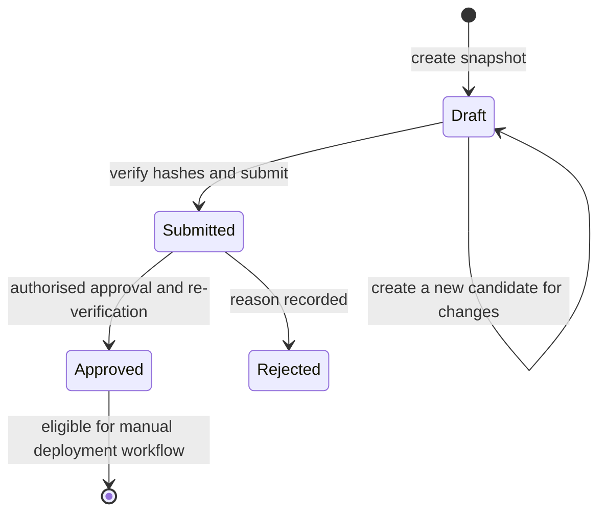

# Forge deployment candidates

Forge deployment candidates are immutable, auditable snapshots of exactly what an operator proposes to release. Creating or approving a candidate never deploys a website.

## Lifecycle

A draft captures the tracked generated workspace path/version and a deterministic SHA-256 content hash, the repository release/commit identifier when configured, every current approved artifact version/hash, and all available QA, security, accessibility, performance, visual, dependency and SBOM evidence. It also captures environment and migration requirements, release notes, rollback plan, creator, and degraded/fallback dependencies.

Submission re-hashes the workspace and checks every frozen artifact ID, version, hash and approval state. PostgreSQL then prevents changes to snapshot fields or deletion. Approval repeats verification. If workspace content or an artifact changes, operators create a new candidate; the optional parent candidate records lineage and the UI gives a concise comparison.

The existing `deployments.execute` capability controls create, submit, approve and reject operations. Reads require `forge.read`. Each transition writes a Forge activity log with actor, candidate, reason, verification details and an explicit `automaticDeployment: false` marker.

The deployment workflow cannot mark a project ready or deployed unless the newest applicable approved candidate still verifies. This prevents an untracked workspace from entering deployment while retaining the existing state-machine, QA, accessibility and degraded-output controls.

## Migration and operation

Apply `admin/drizzle/0040_forge_deployment_candidates.sql` using the existing migration process. Set `GIT_COMMIT_SHA` or `ERROR_MONITORING_RELEASE` in the server environment to attach a repository release identifier; otherwise the workspace content hash remains authoritative.

Candidate hashing excludes transient or dependency directories (`node_modules`, `.next`, `.git`, `coverage`) and runs only after the existing workspace canonicalisation, ownership and symlink checks. Evidence is stored as references and immutable metadata snapshots; secrets and workspace source content are not copied into the candidate row.

Residual operational constraint: scan and SBOM completeness depends on the corresponding Forge artifacts having been generated before the candidate is created. Missing categories remain visibly empty and should prevent human approval under the release checklist appropriate to the project.
