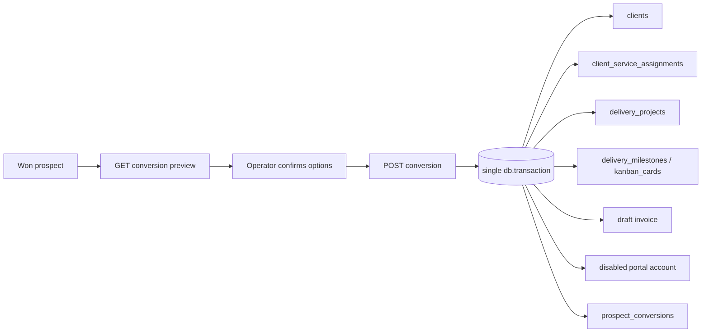

# Prospect-to-client conversion

Converting a won opportunity into an operating client is a single deliberate admin action. It stays inside the
modular monolith and shares PostgreSQL with the rest of admin. The stable server API is
`admin/src/lib/server/prospect-conversion.ts`; the route handler is
`admin/src/app/api/prospects/[id]/conversion/route.ts` (`GET` preview, `POST` execute). The workflow never
sends email, issues an invoice, or provisions portal credentials.

## Overview

The conversion turns opportunity context (`prospects`, `outreach_activities`, `proposal_trackings`,
`sales_proposals`, latest `lead_score_snapshots`) into: a client (created or linked), optional service
assignments, an optional delivery project, optional onboarding tasks, an optional draft invoice, and an
optional disabled portal account. Every result is recorded on one `prospect_conversions` row that also
freezes the opportunity snapshot and the confirmed options.

## Capability model

- `GET` preview requires `leads.read`. It is a read-only projection of the opportunity, client match
  candidates and the active invoice catalogue.
- `POST` execute requires `prospects.convert`. Only `sales` and `project_manager` hold it.
- Execution is an elevated service: it writes across CRM, delivery, finance and portal tables in one
  transaction. That reach is why the capability is narrow and separate from `leads.write` and
  `clients.write`; the single entry point keeps the cross-domain write auditable.

## Preview to confirm flow

`previewConversion` loads the opportunity, any existing conversion record, all clients and the catalogue,
then returns a conversion plan: suggested client name, matched client candidates, suggested tier, suggested
catalogue items, and a proposed project name. The operator reviews and adjusts every option before
confirming. `POST` carries the confirmed `options` object; nothing from the preview is trusted implicitly on
execute — `parseConversionOptions` re-validates the payload server-side.

## Atomic execution

`executeConversion` performs all work inside one `db.transaction`. It takes `SELECT ... FOR UPDATE` on the
prospect row, then in order: create-or-link the client, insert service assignments, build the frozen
opportunity snapshot, optionally create the delivery project, optionally seed onboarding tasks, optionally
create the draft invoice, optionally prepare the disabled portal account, insert the `prospect_conversions`
row, link the prospect (`converted_client_id`, `won_at`), and emit one internal `client_timeline_events`
entry. Collaborating services expose `…WithTx` variants (`createDeliveryProjectWithTx`,
`createInvoiceWithTx`, `prepareDisabledPortalAccountWithTx`) so they enlist in the caller's transaction
rather than opening their own. Any failure rolls the whole conversion back.

## Idempotency

`prospect_conversions.prospect_id` is unique. Inside the transaction, execute re-reads that row first; if it
exists the existing record is returned unchanged and no further writes occur. A retried or double-submitted
`POST` is therefore safe and returns the original conversion. The preview also surfaces the existing
conversion id when one is present.

## Client dedupe

The preview computes match candidates from the prospect business name and contact email against existing
clients (`matchExistingClients`, reporting which fields matched). The operator then chooses explicitly:

- `mode: "create"` — insert a new client with the confirmed name, tier, MRR and invoice client code.
- `mode: "link"` — attach the conversion to an existing client id. A guarded `tx.update(clients)` fills only
  empty fields (tier, invoice client code) and applies MRR when supplied; it never overwrites existing
  values.

There is no silent duplicate: linking is always an explicit operator decision, and a duplicate invoice
client code raises a `409` rather than being coerced.

## Services as catalogue assignments

- Tier is stored on both `clients.tier` (the client's operating tier) and
  `prospect_conversions.assigned_tier` (what this conversion assigned).
- Each selected catalogue item becomes a `client_service_assignments` row
  (`client_id`, `catalogue_item_id` → `invoice_catalogue_items`, `source_prospect_id`, `assigned_by`,
  `active`), deduplicated by `unique(client_id, catalogue_item_id)` — a re-run reuses the existing
  assignment.
- When a draft invoice is requested, the same catalogue items seed its line items (quantity 1 at the
  catalogue `default_unit_amount`). Assignments are the durable catalogue link; invoice items are a
  point-in-time copy.

## No auto-send guarantees

- The draft invoice is created in `draft` status only. Conversion never issues, finalises or delivers it.
- The portal account is prepared disabled with no password set and no credentials generated or sent.
  `portal_provisioning_prepared` records that the shell exists; a separate deliberate action activates it.
- The conversion service imports no email, notification or invoice-delivery modules. A unit import-guard
  test (`admin/src/lib/prospect-conversion.test.ts`) asserts the source matches none of `resend`,
  `invoice-delivery`, `client-request-notifications`, `safe-outbound`, `nodemailer`, `sendMail` or
  `monthly-report`.

## Data written per option

| Option | Tables written |
| --- | --- |
| Always | `clients` (insert or guarded update), `prospect_conversions`, `prospects` (link), `client_timeline_events` (one internal event) |
| Services selected | `client_service_assignments` (one row per catalogue item, `onConflictDoNothing`) |
| Create project | `delivery_projects` (+ its audit/timeline writes via `createDeliveryProjectWithTx`) |
| Onboarding tasks | `delivery_milestones` when a project was created, otherwise client-scoped `kanban_cards` with `tag: "onboarding"` |
| Create draft invoice | draft `invoices` + invoice items via `createInvoiceWithTx` |
| Prepare portal | disabled `portal_client_accounts` shell via `prepareDisabledPortalAccountWithTx` |

`prospect_conversions.metadata_json` additionally records the confirmed `options`, the frozen
`opportunitySnapshot`, per-step `steps` status, `serviceAssignmentIds`, and `portalAccountId` when a portal
shell was prepared.
