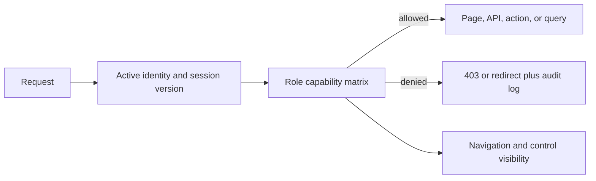

# Admin RBAC policy

`admin/src/lib/rbac.ts` is the authoritative role/capability policy. Pages, APIs, server actions, navigation, UI controls, and query-scope checks must call this module or the server wrappers in `admin/src/lib/server/rbac.ts`. Do not add role-name checks in product features; owner-only identity invariants remain in the identity domain because they protect the ownership model itself.

## Capability matrix

| Role | Capabilities |
| --- | --- |
| owner | all capabilities |
| administrator | all capabilities except owner assignment and password reset; cannot bypass final-owner invariants |
| sales | leads read/write, clients read, projects read, finance read |
| project_manager | leads read, clients read/write, projects read/write, Forge read/execute/approve/configure, finance read, audit read |
| developer | clients read, projects read/write, Forge read/execute/approve/configure, audit read, deployments execute |
| finance | leads read, clients read, projects read, finance read/write, audit read |
| viewer | leads read, clients read, projects read, Forge read, finance read |

Defined capabilities are `users.manage`, `users.reset_password`, `users.assign_owner`, `leads.read`, `leads.write`, `clients.read`, `clients.write`, `projects.read`, `projects.write`, `forge.read`, `forge.execute`, `forge.approve`, `forge.configure`, `finance.read`, `finance.write`, `settings.manage`, `audit.read`, and `deployments.execute`.

## Enforcement

Node middleware reloads the persisted user, validates session version/active status, maps the request path and method to a capability, and rejects denied APIs with 403 before the handler runs. Denied pages redirect to the dashboard. Sensitive path rules for audit exports, Forge integrations, approvals, and deployment execute before generic Forge rules. Body-dependent actions additionally call `guardApiCapability` inside the handler.

Server helpers:

- `requireCapability`: base server guard;
- `guardPageCapability`: redirecting page guard;
- `guardApiCapability`: API handler guard;
- `guardServerActionCapability`: server-action guard;
- `requireQueryScope`: capability plus database-scope assertion;
- `hasCapability`, `isNavigationVisible`, and `canUseControl`: client-safe policy decisions.

Current business tables have no per-admin ownership columns, so authorised database scope is `global`; unauthorised scope is `none`. Introduce explicit tenant/assignee ownership before adding row-level filters.

Every denied request emits a redacted structured warning and monitoring message with actor ID, role, capability, method, pathname, and request ID. No request body is included.

## Change control

Any new API route must map to a capability. The RBAC tests enumerate non-auth route files and fail if a route has no GET or POST policy. Changes to roles or capabilities must update the explicit matrix test and receive a security review.
