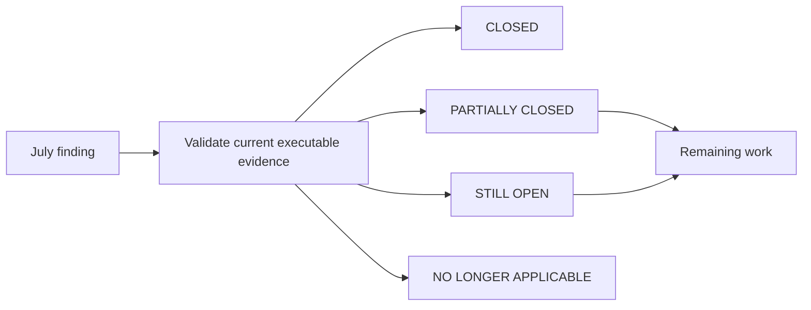

# Current residual-risk register

**Assessment date:** 31 August 2026
**Scope:** Re-evaluation of residual risks recorded by the July 2026 ScaleSmiths architecture, production-readiness, dependency, and security audits  
**Authority:** Current-state classification; historical reports remain unchanged evidence of their audited revisions

This register is derived from the [July production-readiness audit](../audits/production-readiness-final.md), [July dependency and CI security audit](../security/dependency-audit-2026-07.md), and [July system overview](system-overview.md). Each finding was checked against current application code, migrations, CI, infrastructure configuration, tests, and operations documentation. Repository evidence establishes implementation, not activation of external GitHub, Cloudflare, VPS, provider, or backup infrastructure.

Classifications:

- **CLOSED:** the repository now contains the control and regression evidence appropriate to the finding;
- **PARTIALLY CLOSED:** material controls exist, but a narrower implementation or operational-evidence gap remains;
- **STILL OPEN:** the original risk remains materially present;
- **NO LONGER APPLICABLE:** the original condition or intended architecture no longer exists.

## Register

| Finding | Previous state | Current state | Evidence | Action taken | Remaining work |
| --- | --- | --- | --- | --- | --- |
| Generated dependency admission and per-site SBOM | High: absent; evidence could be owner-overridden | **CLOSED** | `forge-dependency-admission.ts`, policy registry, migration `0043`, candidate hash binding, non-overridable release gates, tests and Security image SBOMs | Current docs identify the control as implemented | Continue policy/advisory refresh; no closure work remains |
| Production monitoring adapter | High: abstraction existed but production adapter was a no-op | **PARTIALLY CLOSED** | Web/admin Sentry adapters, monitoring tests, source-map BuildKit secret handling, `docs/operations/error-monitoring.md` | Classified adapter implementation separately from production activation | Approve privacy/subprocessor position and provide staging/production delivery and alert evidence |
| Backup automation and restore evidence | High: documented only, no schedule or RPO/RTO | **PARTIALLY CLOSED** | Encrypted bundle/validation/restore/prune scripts, systemd timers, 24h RPO/60m RTO policy, Docker and CI framework tests | Current baseline and register distinguish framework tests from recovery proof | Run and approve an isolated production-derived restore; verify off-host object lock and achieved RPO/RTO |
| Production database grants and ownership | High: one credential and application-level isolation only | **PARTIALLY CLOSED** | Dedicated principals, exact web/delete/sequence/function policy, migration ownership, default ACLs, runtime Compose variable blanking, and a real PostgreSQL catalog verifier with injected-drift rejection | Removed admin Drizzle-schema access, narrowed web/read-only sequences and admin deletes, isolated tool environments, and added CI verification/repair proof | Run the non-mutating verifier against an isolated production-derived restore and the live target during an approved window; repository tests cannot prove live grants |
| Client/database isolation | High: no role separation or RLS | **PARTIALLY CLOSED** | Narrow web grants; admin DML-only role; forced transaction-scoped RLS on analytics/optimisation tables; portal query ownership tests | Consolidated remaining gap under canonical tenant identity | Portal/report/request and Forge isolation remains application-level until external text and internal integer client identities are unified |
| Mutable applied migration history | High: older SQL appeared modified | **CLOSED** | `migration-checksums.json`, history/consistency checks, proven historical prefixes, forward reconciliation migrations, clean and upgrade paths | Current docs use actual `0015`/`0050` endpoints and forward-only policy | Production-derived upgrade proof remains part of the backup drill, not a migration-history defect |
| Fresh shared-database migration ordering | Release-blocking: web `0018` reads admin-owned `clients` before the admin history creates it | **CLOSED** | The checksum-preserving shared planner completed fresh 21/59 and historical-upgrade PostgreSQL tests; production, CI, restore verification and app helpers now call it; advisory locking and structural equivalence protect concurrency/duplicate DDL | Removed the test-only SQL rewrite and invalid web-then-admin production path; privilege, backup guards, release simulation and concurrent-runner certification are green | Production-derived restore remains separately unverified because no production-derived backup has been supplied |
| Post-migration application integration certification | Correct migrations exposed stale fixtures and application-contract drift in prospect conversion, offboarding and Forge lease recovery | **CLOSED** | Real PostgreSQL integration passes 72/72 through the canonical shared migrator; Forge workflow E2E passes with canonical client validation; admin lint, TypeScript and production build pass; portal/Forge isolation tests remain green | Repaired production defects at their domain boundaries and updated stale fixtures without weakening validation, RBAC or tenancy | Keep the suites required in CI; live production-derived restore remains a separate operational-evidence gap |
| Forge E2E repair cycle | Medium: local run timed out and left a child process | **CLOSED** | Guarded isolated Forge E2E, manual-worker mode, retries disabled, cancellation cleanup, persisted-cancellation checks, CI workflow | Retired the obsolete incomplete-run finding | Real providers and production visual/human acceptance remain deliberately separate gates |
| Durable monitoring and log retention | Medium: stdout/no-op monitoring had no retention | **PARTIALLY CLOSED** | Structured redacted JSON logs, request IDs, Sentry adapters, Vector/log-shipping configuration, rotation settings and tests | Removed the obsolete “no adapter” implication | Prove production shipping, access controls, retention, alert routing, and failure notification |
| Forge outbound DNS rebinding/TOCTOU | Medium: DNS checked before a separately resolved `fetch` | **STILL OPEN** | `safe-outbound.ts` validates protocols, redirects, credentials, addresses, sizes and timeouts but does not bind the HTTP connection to the validated address | Kept explicitly open in current architecture | Use a restricted egress proxy/resolver or validated-address connection while preserving TLS hostname verification |
| Process-local Forge operational controls | Medium: queue, rate limits and previews were process memory | **PARTIALLY CLOSED** | PostgreSQL `forge_jobs`, `rate_limit_counters`, `forge_previews`; atomic counters; job and preview leases; worker recovery; cleanup routines | Re-audited across every public and expensive endpoint: no production path uses a process-local limiter, and the remaining in-memory helpers are test-only | Worker execution remains inside admin and shares its broad runtime role; extract only with complete operational isolation |
| Rate limiting and abuse control coverage | High: public origin had no edge limiting, analytics ingestion had no limit, and the public proxy appended a client-supplied `X-Forwarded-For` that the apps read leftmost — a complete per-IP bypass | **PARTIALLY CLOSED** | Nginx `limit_req`/`limit_conn` zones answering 429, public proxy snippet overwriting the forwarding chain, trusted IPv6-/64-aware client resolution in both apps, new limits on analytics ingestion, portal request creation, MFA activation and invoice delivery, `web_rate_limits` durable counters, 429 semantics with `Retry-After`, unit and real-Nginx tests | Replaced spoofable leftmost `X-Forwarded-For` reads and the portal's 401-on-throttle, and documented the model in `rate-limiting-and-abuse-controls.md` | Public origin is still not proxied through Cloudflare, so it has no DDoS/bot layer ahead of Nginx; enabling that and alerting on sustained 429 volume remain external configuration |
| Orphaned Forge resources | Medium consequence of interrupted jobs and runtime-owned resources | **PARTIALLY CLOSED** | Canonical `reconcileForgeResources` service and worker/manual paths cover expired job and preview leases, stale run state and expired AI reservations; cleanup is guarded, idempotent, auditable, dry-runnable, and reports partial failures | Replaced the preview-only description; workspaces, artifacts and deployment candidates are intentionally retained as evidence rather than age-deleted | Approve long-term evidence retention/deletion policy and verify production monitoring receives reconciliation failures |
| Forge job/run failure reconciliation | E2E/runtime failures could leave processing state inconsistent | **CLOSED** | Expired job leases requeue/dead-letter; `recoverForgeRuns` repairs missing/cancelled/completed/failed job outcomes; run events retain failure category/message; worker invokes recovery | Recorded separately from the remaining in-process-worker concern | Operational dashboards and retention are improvements, not correctness prerequisites |
| Prompt injection and semantic provider error | Medium: valid structured output could still be influenced | **STILL OPEN** | Schemas, source labelling, approved facts, provenance, QA, human approval and immutable release candidates reduce impact but cannot prove semantic truth | Kept as an inherent residual risk rather than a missing schema control | Maintain human review; expand adversarial evaluation and never allow provider output to grant approval or deploy directly |
| Production dependency advisories | Medium: Next/PostCSS/Sharp advisories in production tree | **CLOSED** | Exact-pinned governed dependencies and overrides; recorded production audits reached zero known findings; Security reruns production audit on every relevant event | Distinguished closed production findings from the separate dev-tool acceptance | Continue automated audits; remove overrides only when supported upstream versions make them unnecessary |
| Development-only Drizzle Kit advisory chain | Moderate development tooling risk | **STILL OPEN** | Current accepted chain is confined to Drizzle Kit/@esbuild-kit/esbuild and absent from production installs; governance prevents unsafe forced downgrade | Retained as a separate bounded risk | Upgrade when a compatible supported Drizzle Kit path removes the chain; do not use `npm audit fix --force` |
| Auth.js beta dependency | Medium: `5.0.0-beta.31` | **STILL OPEN** | Now exact-pinned at `5.0.0-beta.32`; bcrypt, MFA, secure cookies, session-version revocation, middleware and browser authentication tests constrain impact; risk acceptance has a review date | Updated version/context without broadening the acceptance | Review and migrate to an appropriate stable release before the acceptance deadline |
| Host-Nginx request-level integration | Medium: configuration prose only | **CLOSED** | Shared production snippets, disposable Nginx harness, `nginx -t`, request tests for host routing, headers, limits, errors, generated-site denial, unknown hosts and Cloudflare trust; CI jobs | Removed stale current-security statement | Real TLS/DNS/Cloudflare checks remain post-deployment evidence, not this finding |
| Public health endpoint disclosure | Low: release/environment metadata could expand | **CLOSED** | Health handlers return bounded status/service/release data; topology and release tests rely on that minimal contract; no dependency/database detail | Retained minimal contract in the architecture baseline | Do not add configuration, dependency, database, host, or secret detail |
| Rate-limit actor identity | Low: mutable admin email used in key | **CLOSED** | Durable database counter plus `resolveForgeRateLimitActor` preferring persisted user ID; focused unit test | Replaced email-first keying with stable persisted identity | None |
| Example placeholder credentials | Low: operators might deploy example values | **PARTIALLY CLOSED** | Real env files are excluded; environment hygiene and local-state checks protect Git; production Compose requires dedicated URLs; security run scans history; release checklist requires replacement review | Kept as operational verification rather than treating examples as secrets | Add executable runtime completeness/placeholder validation without ever logging values |
| Analytics retention/deletion ownership | Low: collection minimised but retention not enforced | **STILL OPEN** | Consent/GPC/DNT, event minimisation and configurable retention policy exist; no scheduled pruning implementation proves deletion | Kept open in current architecture/backlog | Add bounded deletion job, audit metrics, operator ownership, and tests for configured retention windows |
| Automated backup and Nginx simulations | Nice-to-have: recommended for scheduled CI | **CLOSED** | Backup framework/safety and release simulation jobs plus Nginx config/request harness are present in CI | Retired the stale recommendation | Production-derived restore and live edge smoke remain separate controls |
| Environment-variable ownership enforcement | Nice-to-have: ownership documentation only | **PARTIALLY CLOSED** | Dedicated database resolution fails closed in production; Compose clears unrelated DB and build-only monitoring variables; generated environments use an allowlist; env hygiene blocks committed secrets | Current baseline describes the implemented process separation | Add a complete executable ownership manifest covering runtime, build, migration, backup, test, generated-site and host-only variables |
| Secret exposure prevention | General residual: server-only policy and examples required operator care | **PARTIALLY CLOSED** | Env hygiene, local-state hygiene, `.gitignore`, server-only provider modules, generated-process allowlist, redaction tests, TruffleHog, BuildKit secret mounts, dedicated encryption keys | Revalidated repository controls; no secret values were emitted during this audit | Enable GitHub native secret scanning/push protection and remove historical Freebuff state through a coordinated rewrite |
| Failed-release auditability | Deployment failures needed durable, safe forensic state | **CLOSED** | Release manager already stored successful prepare/switch/rollback events and atomic state; it now records safe `release_prepare_failed` and `release_switch_failed` events plus failure stage, without command diagnostics | Added failed-record/event implementation and regression tests | External shipping/retention of `/var/lib/scalesmiths-release` logs remains an operational control |
| Authorization coverage | Central RBAC existed but was not exhaustive across routes/clients | **PARTIALLY CLOSED** | Explicit role/capability matrix; middleware enforcement; direct-route tests; filesystem enumeration fails if a non-auth admin API has no mapping; portal pages/APIs filter by authenticated client; invoice portal tests | Current docs distinguish route-map completeness from full behavioural E2E | Add authenticated browser/API matrix coverage for critical portal and admin lifecycle operations and negative cross-client cases |
| External production smoke checks | Nice-to-have: no outside-in post-release check | **STILL OPEN** | Release manager verifies loopback and optional public health during switching; CI uses local/disposable topology | Kept separate from Nginx integration closure | Add external synthetic checks through the real Cloudflare/Nginx path with alerting and safe authenticated probes where justified |
| Deployment and environment boundaries | Operational topology could drift across Compose variants | **PARTIALLY CLOSED** | Canonical root/origin policy, host-Nginx blue/green manager, loopback-only app ports, hostname separation, migration tool profiles, environment blanking, topology and release-simulation tests | Current baseline names host-Nginx blue/green as canonical and treats other Compose files by purpose | Verify live Cloudflare/origin firewall, secrets, containers, generated-site ownership, and active release records for each production release |

## Current open-risk summary

The risks requiring new engineering implementation are fresh shared-database migration ordering, DNS-pinned Forge egress, canonical tenant identity/RLS expansion, analytics retention, environment ownership validation, dedicated Forge worker isolation/operations, Auth.js and Drizzle development dependency exits, broader authorization/E2E coverage, workspace retention, and external synthetic monitoring.

The risks requiring external or human evidence are repository protection/security settings, production monitoring/log shipping, Cloudflare/origin enforcement, production-derived restore, off-host backup controls, and production release validation. Repository tests must not report those external controls as active merely because their configuration is present.

## Retired during the consolidation review

- **Plaintext portal-password administration — CLOSED:** the obsolete test-account/generated-password API branch and its validation helper were removed. Portal enrolment and recovery now use only the hashed, expiring, single-use activation/reset lifecycle; internal administrator credential management remains a separate capability surface.
- **R2 described as future-only — CLOSED:** current architecture and topology documentation now identify R2 as the implemented private client-document binary store, with PostgreSQL retaining scoped metadata, integrity, visibility, and audit records.
