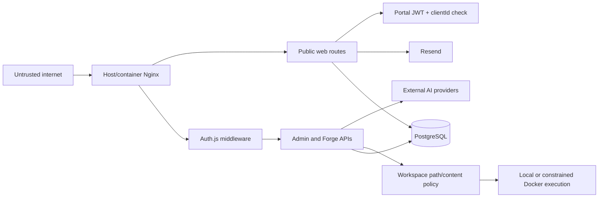
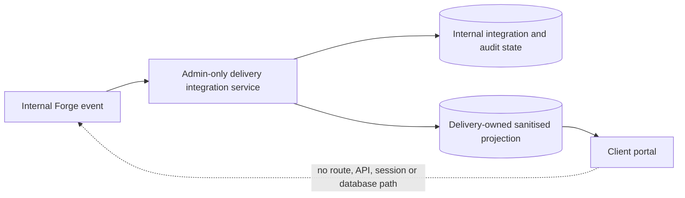

# Security boundaries

## Trust zones

## Public application boundary

The marketing site is public. Quote submission is untrusted input and is protected by body limits, validation, honeypot/rate-limit logic, normalized fields, database persistence, and fail-aware Resend delivery status. The public production container receives only its web runtime database URL; server/client separation in Next.js remains important and only `NEXT_PUBLIC_*` variables may enter browser bundles.

Commercial claims and testimonials fail closed. Admin stores proposed wording, private evidence references and review audit data in base tables; the web role cannot read those tables and can only select the restricted `public_verified_claims` view. The view requires an evidence row, verified/client-approved state and a future review date, while components additionally enforce route/component permissions. Missing database access produces neutral capability copy or no testimonial, not an unverified fallback.

Portal login accepts untrusted credentials, uses bcrypt for stored accounts, database-backed login limits, and an HTTP-only, SameSite=Lax, production-secure JWT cookie. Every portal resource is filtered by the session client ID. Internal request messages are excluded from client-visible queries. Demo authentication is an explicit environment override and must remain disabled in production.

### Forge and client portal trust boundary

**Forge is an internal privileged ScaleSmiths delivery system and is outside the client portal trust boundary.** Forge routes, APIs, runs, prompts, agents, artifacts, provider metadata, budgets, costs, workspaces, QA evidence and deployment controls exist only in the authenticated admin application. A portal JWT is not an Auth.js admin session and grants no capability in the admin application.

The commercial delivery project remains authoritative. An optional `delivery_forge_integrations` record holds internal Forge project, run, candidate, release and deployment references. The web schema has no mapping for that table and portal queries never join Forge operational tables. Internal events cross the boundary only through a fixed allowlist that writes a business-level status, next step, deliberately published safe staging URL and sanitised timeline wording to delivery-owned tables.

Client staging links require explicit publication, credential-free HTTPS, and rejection of admin, local, Forge, sandbox and token-bearing URLs. Internal preview URLs are never projected automatically.

## Admin boundary

Admin has no signup. Persistent internal identities are authenticated by Auth.js credentials and eight-hour JWT sessions. Middleware denies unauthenticated requests and reloads the database identity to enforce active status and session revocation version across pages and APIs. Production depends on a strong `AUTH_SECRET`; passwords are stored only as bcrypt hashes. Owner/administrator management is authenticated server-side, owner grants and password resets require an owner, and the final active owner is protected.

Privileged production identities require TOTP MFA after a bounded bootstrap grace deadline. TOTP secrets use AES-256-GCM server-side encryption, recovery codes use salted scrypt hashes and single-use transactional consumption, and setup/failure/disablement events are persisted without secret material.

Forge mutation/task rate limiting uses atomic PostgreSQL fixed-window counters keyed by the persisted admin user ID, method, path and bucket. Counters are shared across replicas and expired rows are pruned by the worker. Middleware deliberately fails open and emits a monitoring warning if the database limiter is unavailable, because a limiter outage must not lock all administrators out; this availability choice remains a bounded residual risk.

## Database boundary

Production database access is separated between web runtime, admin runtime and migration-owner credentials. Runtime containers do not receive the migration URL, cannot create schema objects and do not own either migration journal. Client analytics and optimisation rows additionally enforce transaction-scoped PostgreSQL RLS. See [PostgreSQL access boundaries](database-access-boundaries.md).

## AI boundary

Prompts and upstream artifacts are untrusted provider inputs. Provider code is `server-only`; API keys never belong in project records or generated output. Responses must satisfy a declared JSON schema. Safety prompts prohibit secrets, telemetry, destructive commands, and unknown outbound calls. Safe error messages avoid returning provider bodies. Usage and costs are persisted without credentials.

Remaining risks:

- prompt injection can influence semantically valid structured output;
- schema validation guarantees shape, not business correctness;
- provider pricing is source-controlled and estimates may differ from current provider billing;
- reservation enforcement is database-authoritative, but operational alerts and abandoned-reservation cleanup still depend on application activity.

## Generated workspace boundary

Generated files are untrusted until they pass path, filename, content, and executable checks. Paths must remain under `generated-sites/<project slug>`, with allowlisted top-level content. Writes use resolved paths and reject traversal. Generated source is scanned for server-secret access, private keys, destructive shell patterns, and obvious unknown outbound calls.

Production should use `FORGE_SANDBOX_RUNNER=docker`. Docker commands mount only the selected workspace, drop all capabilities, enable `no-new-privileges`, constrain CPU/memory, pass a small secret-free environment, and default QA/build networking to `none`. Install and preview networking are separately configurable. The local runner does not provide this OS isolation.

Pattern scanning is not a complete code-security proof. Obfuscated code, dynamic URLs, package lifecycle scripts, and dependency compromise remain risks. Package installation with bridge networking is therefore an operational trust decision.

## Preview and publication boundary

Preview defaults to `127.0.0.1`, and non-loopback configuration is ignored unless public previews are explicitly enabled. Host Nginx exposes only web/admin services. `generated-sites` is bind-mounted into admin and is never configured as an Nginx document root. Forge export returns reviewed archives; deploy readiness does not imply public exposure.

## Email and integration boundaries

The public app sends quote and client-request notifications through server-only Resend credentials. Forge stores non-secret Resend project configuration and represents the key as environment-owned/redacted. Generated sites refer to `RESEND_API_KEY` only from generated server routes. WhatsApp V1 produces `wa.me` integration behaviour; future Cloud API variables are documented but not a current browser credential path.

## Backup and recovery boundary

The host backup process can read PostgreSQL, the production environment, Nginx, generated workspaces, Docker image metadata, and release state, so it is a privileged root-controlled boundary. Plaintext staging is private and temporary; completed bundles require age-recipient or GPG symmetric encryption outside explicit tests. Logs contain identifiers and outcomes only. Recovery keys/database URL files are separate mode-`0600` inputs, while bundle metadata records ownership, identifiers, UID/GID, and modes without plaintext key material.

Restore commands reject the production repository, require isolation words in both target database and filesystem names, require exact repeated target confirmations, and require a fixed database-level isolated-restore guard comment before resetting only the confirmed database schemas. Evidence must remain outside both production and the disposable restore root. Automated drill evidence never authorises production replacement.

## Residual controls and gaps

The authoritative classifications and evidence are maintained in the [current residual-risk register](residual-risk-register.md). In particular, host-Nginx request behaviour, durable rate limiting, leased preview/container reconciliation, migration immutability, dependency admission and Forge run recovery are now implemented. Production grant verification, tenant-wide RLS, DNS-pinned Forge egress, monitoring activation, external smoke checks, complete authorization E2E coverage, and production-derived restore evidence remain partial or open as recorded there.
