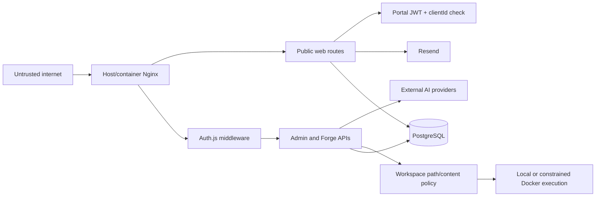

# Security boundaries

## Trust zones

## Public application boundary

The marketing site is public. Quote submission is untrusted input and is protected by body limits, validation, honeypot/rate-limit logic, normalized fields, database persistence, and fail-aware Resend delivery status. The public app receives the shared root environment, so server/client separation in Next.js remains important; only `NEXT_PUBLIC_*` variables may enter browser bundles.

Portal login accepts untrusted credentials, uses bcrypt for stored accounts, database-backed login limits, and an HTTP-only, SameSite=Lax, production-secure JWT cookie. Every portal resource is filtered by the session client ID. Internal request messages are excluded from client-visible queries. Demo authentication is an explicit environment override and must remain disabled in production.

## Admin boundary

Admin has no signup. Persistent internal identities are authenticated by Auth.js credentials and eight-hour JWT sessions. Middleware denies unauthenticated requests and reloads the database identity to enforce active status and session revocation version across pages and APIs. Production depends on a strong `AUTH_SECRET`; passwords are stored only as bcrypt hashes. Owner/administrator management is authenticated server-side, owner grants and password resets require an owner, and the final active owner is protected.

Privileged production identities require TOTP MFA after a bounded bootstrap grace deadline. TOTP secrets use AES-256-GCM server-side encryption, recovery codes use salted scrypt hashes and single-use transactional consumption, and setup/failure/disablement events are persisted without secret material.

Forge mutation/task rate limiting is an in-memory map in middleware. It is per process, resets on restart, and is not globally effective across replicas. It is a safety throttle, not a durable abuse-control boundary.

## AI boundary

Prompts and upstream artifacts are untrusted provider inputs. Provider code is `server-only`; API keys never belong in project records or generated output. Responses must satisfy a declared JSON schema. Safety prompts prohibit secrets, telemetry, destructive commands, and unknown outbound calls. Safe error messages avoid returning provider bodies. Usage and costs are persisted without credentials.

Remaining risks:

- prompt injection can influence semantically valid structured output;
- schema validation guarantees shape, not business correctness;
- provider pricing is source-controlled and estimates may differ from current provider billing;
- reservation enforcement is database-authoritative, but operational alerts and abandoned-reservation cleanup still depend on application activity.

## Generated workspace boundary

Generated files are untrusted until they pass path, filename, content, and executable checks. Paths must remain under `generated-sites/<project slug>`, with allowlisted top-level content. Writes use resolved paths and reject traversal. Generated source is scanned for server-secret access, private keys, destructive shell patterns, and obvious unknown outbound calls.

Production should use `FORGE_SANDBOX_RUNNER=docker`. Docker commands mount only the selected workspace, drop all capabilities, enable `no-new-privileges`, constrain CPU/memory, pass a small secret-free environment, and default QA/build networking to `none`. Install and preview networking are separately configurable. The local runner does not provide this OS isolation.

Pattern scanning is not a complete code-security proof. Obfuscated code, dynamic URLs, package lifecycle scripts, and dependency compromise remain risks. Package installation with bridge networking is therefore an operational trust decision.

## Preview and publication boundary

Preview defaults to `127.0.0.1`, and non-loopback configuration is ignored unless public previews are explicitly enabled. Host Nginx exposes only web/admin services. `generated-sites` is bind-mounted into admin and is never configured as an Nginx document root. Forge export returns reviewed archives; deploy readiness does not imply public exposure.

## Database boundary

Both apps use the same database credential and therefore have database-level access beyond their logical ownership. Isolation is implemented in application queries, not PostgreSQL roles or row-level security. Admin and web independently declare shared tables and run separate migration histories. A migration collision or schema drift can affect both applications.

## Email and integration boundaries

The public app sends quote and client-request notifications through server-only Resend credentials. Forge stores non-secret Resend project configuration and represents the key as environment-owned/redacted. Generated sites refer to `RESEND_API_KEY` only from generated server routes. WhatsApp V1 produces `wa.me` integration behaviour; future Cloud API variables are documented but not a current browser credential path.

## Residual controls and gaps

- CI now runs dependency review, verified-secret scanning, npm audit thresholds, Dockerfile linting, container scanning, SBOM generation, migration/integration checks, CodeQL and sandbox fixtures;
- generated-site dependency admission, vulnerability/licence evaluation and per-site SBOM production are not implemented, so the dependency release gate has no normal evidence producer;
- no integration test for host-Nginx headers/TLS/routing;
- no database role separation or row-level security;
- no distributed admin/Forge rate limiter;
- no automated restoration/reconciliation of orphaned preview processes or containers;
- RBAC matrix and direct-route tests exist, but there is no exhaustive end-to-end authorization matrix across every admin and portal API.
