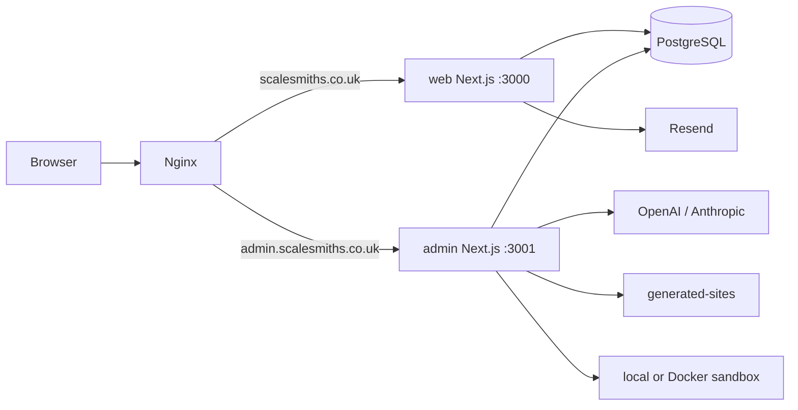

# ScaleSmiths system overview

This document describes the repository on `master` as audited on 10 July 2026. It is an implementation map, not a target architecture.

## Repository shape

| Area | Location | Responsibility |
| --- | --- | --- |
| Public application | `web/` | Marketing site, traditional and interactive experiences, quote capture, client portal |
| Internal application | `admin/` | Admin CRM, client operations, proposals, reports, and Forge |
| Shared database | PostgreSQL | Separate least-privilege production runtime roles; one migration owner applies the independent web then admin Drizzle histories |
| Generated workspaces | `generated-sites/` | Per-Forge-project Next.js workspaces; bind-mounted only into admin in production |
| Edge routing | `nginx/` | Container-owned and host-Nginx variants |
| Deployment | `docker-compose*.yml` | Development, container-Nginx production, and host-Nginx production variants |
| CI | `.github/workflows/ci.yml` | Separate web/admin lint, test, build jobs plus root environment hygiene |

## Public web application

`web/src/app` uses the App Router. The root experience is selected by `ExperiencePreference` and preserves two explicit entry routes:

- `/`: canonical conventional marketing homepage, with a human-only first-visit choice or interactive CTA selected by the controlled experience experiment. The legacy `/traditional` path permanently redirects to `/?experience=normal` and is not indexable or listed in the sitemap.
- `/interactive`: V2 interactive experience, including `V2InteractiveExperience`, `BusinessSimulationLayer`, conversion UI, and the dynamically loaded Three.js `ClientSceneCanvas`.
- `/services`, `/local-growth`, `/custom-systems`, `/pricing`, `/work`, `/quote`, `/local-growth-check`, and SEO landing pages: conventional public acquisition routes. The two service journeys separate local growth from custom systems without changing the ScaleSmiths brand or retiring search-intent pages. The local growth check remains a short funnel over the same secured quote persistence path; the premium quote wizard remains separate and unchanged. See `docs/architecture/public-service-routing.md`.
- `/api/quote`: validates, rate-limits, persists, scores, and sends lead notifications through Resend.
- `/portal`: authenticated client operating hub, requests, threaded messages, timeline, and published monthly reports.

Marketing data is mostly repository-owned (`web/src/lib/data.ts`, landing/service data, and build logs). The interactive scene configuration lives under `web/src/lib/v2` and `web/src/components/v2`.

## Admin application

`admin/src/app` is also App Router based. `admin/src/middleware.ts` protects every non-static route except Auth.js endpoints and `/login`. Protected screens cover:

- dashboard, clients, messages, requests, and roadmap/kanban;
- prospects, outreach activities, proposal tracking, and generated sales proposals;
- Forge project list, creation, project detail, artifacts, preview, QA, integrations, export, and deployment readiness.

The UI calls authenticated route handlers in `admin/src/app/api`. Domain code is split between framework-neutral modules in `admin/src/lib` and server-only orchestration in `admin/src/lib/server`.

## Authentication

### Admin

Auth.js v5 uses a credentials provider in `admin/auth.ts`, persistent `admin_users`, and JWT sessions with an eight-hour lifetime. There is no signup route. Passwords are bcrypt hashes. Roles and session versions are embedded in the JWT, while Node middleware reloads the database identity on protected requests so disabled accounts and revoked sessions fail closed. Login attempts use database-backed rate-limit rows. Middleware also applies a process-local Forge mutation/task limiter.

### Client portal

The portal does not use Auth.js. It authenticates `portal_client_accounts` with bcrypt, signs an eight-hour HS256 JWT using `PORTAL_SECRET`, and stores it in the HTTP-only `ss-client-session` cookie. Server pages and route handlers check that the token `clientId` exactly matches the requested client. A separate environment-driven demo account is disabled unless `DEMO_PORTAL_ENABLED=true`.

## Business capabilities

| Capability | Primary implementation |
| --- | --- |
| Quote/lead capture | `web/src/app/api/quote`, `quote_requests`, quote security and Resend notifications |
| Client portal | `web/src/app/portal`, portal auth/session, shared request/report tables |
| Client operations | admin clients, kanban, messages, requests, timeline, reports |
| Prospect CRM | prospects, outreach activities, proposal tracking and prospect APIs |
| Sales proposals | `sales_proposals` plus `server/sales-proposal-generator.ts`; may consume Forge artifacts |
| Monthly reports | shared report table; admin generator and CRUD, portal reads published records |
| Forge | persisted project/task/job/artifact/memory/usage model and server-only agents |

## Tests and current coverage

Vitest is used in both applications. Web tests concentrate on portal authentication/requests, rate limiting, quote safety, notifications, landing/service data, and monthly reports. Admin tests concentrate on Forge domain rules, jobs, costs, deployment/export/proposal/SEO/visual QA, repair syntax, client-request triage, prospects, reports, and sales proposals.

Important gaps:

- Chromium journeys and visual baselines plus focused Firefox/WebKit smoke tests run in CI, but live browser/provider integrations remain out of scope;
- route-handler authorization and middleware behaviour have little direct integration coverage;
- migration compatibility is exercised from an empty shared PostgreSQL database, but upgrades from every historical production snapshot are not continuously reproduced;
- no real provider contract test runs against OpenAI, Anthropic, or Resend;
- harmless Docker sandbox fixtures and application images are exercised in CI; preview lifecycle, Nginx routing, and full Compose topology still lack request-level CI coverage;
- interactive experience routing, fallback behaviour and key accessibility behaviours have browser coverage, but real GPU rendering quality still requires visual/manual review;
- most admin React screens have no component tests.

## Audit findings

### Duplicate responsibilities and hidden coupling

- Shared operational tables (`quote_requests`, client requests/messages/timeline, monthly reports, and login limits) are declared independently in both schemas. This is deliberate runtime sharing but has no shared schema package or compatibility gate.
- Client-request triage types/rules exist in both applications. They currently mirror one another and can drift.
- Proposal terminology covers two distinct systems: Forge proposal artifacts and persisted CRM `sales_proposals`/`proposal_trackings`.
- Forge agents repeatedly implement the task-create/run/complete/fail and artifact-upsert pattern instead of using one transaction/orchestration abstraction.
- Artifact metadata and Forge memories act as cross-stage contracts; many dependencies are title/key strings rather than foreign-keyed typed records.

### Unused or stale-looking modules

No module was deleted during this audit. Static inspection found no confidently dead production module, but `web/src/lib/build-logs.ts` is editorial/static content despite its operational-sounding name, and several compatibility re-export/client-safe modules under `admin/src/lib` are used indirectly by UI, tests, or server agents. Treat removal as a separate reachability exercise.

### Cycles

No direct import cycle was found in the traced web, authentication, CRM, or Forge paths. The larger architectural cycle is data-level: admin writes records consumed by web while both applications independently define and migrate those records.

### README drift

- The README says “two Next.js apps, one Docker Compose stack”, but three Compose variants exist.
- Its initial production quickstart brings the full stack up without first showing the two migration services; later sections provide the correct migration order.
- Forge is described extensively later in the README, but the opening architecture summary does not expose its job worker, sandbox, workspace, preview, artifact, or AI-usage subsystems.
- The generated-site workspace is not a public web root; this is correctly stated later but is easy to miss in the initial deployment instructions.
