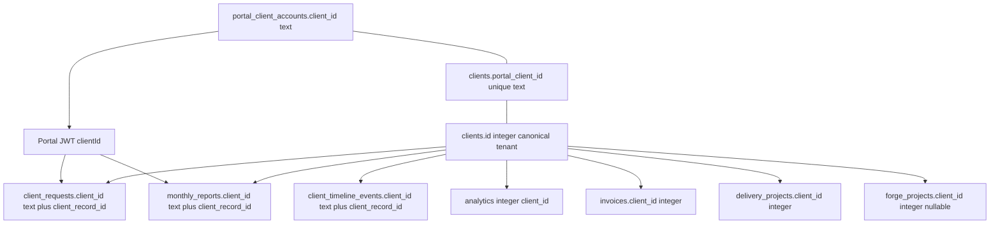

# Canonical tenant identity

Portal login, CRM records, analytics RLS, invoices, delivery, reports, requests and Forge currently mix an external text portal identifier with an internal integer CRM primary key. This document is the accepted identity model for ScaleSmiths. Executable schema, RLS helpers and tests remain the source of truth when they change.

## Canonical mapping

| Identifier | Storage | Role |
| --- | --- | --- |
| Canonical tenant | `clients.id` (integer, admin-owned) | The only tenant key RLS policies compare. Analytics already uses it as `app.current_client_id`. |
| External portal ID | `portal_client_accounts.client_id` (text, unique) | Login identity copied into the portal JWT as `clientId`. Existing portal URLs and cookies keep this value. |
| CRM bridge | `clients.portal_client_id` (text, unique, nullable) | Must equal the portal account `client_id` when a portal exists. Provisioning writes it as `portal-client-{id}` when absent. |
| Compatibility copies | `client_requests.client_id`, `monthly_reports.client_id`, `client_timeline_events.client_id` | Existing text portal IDs. They remain the public/compatibility key and are not replaced. |
| Mapped tenant FK | `*.client_record_id` → `clients.id` | Additive integer FK used by fail-closed RLS. A BEFORE INSERT/UPDATE trigger fills it from `clients.portal_client_id` when omitted. |

Rules:

1. One CRM client has at most one portal account.
2. A portal session is valid only when the account is active and the CRM bridge row exists. Missing mapping is fail-closed: the portal cannot read or write tenant rows.
3. Application queries may keep filtering by the authenticated text portal ID as defence in depth. Database policies ignore that filter and compare `client_record_id` to the transaction-local integer tenant.
4. `portal_client_accounts` itself is not RLS-protected. Login must look up by email before any tenant context exists.

## Access modes

Transaction-local GUCs, never connection-pool leftovers after commit:

| `app.access_mode` | `app.current_client_id` | Meaning |
| --- | --- | --- |
| unset / empty | ignored | Fail closed. No client-owned rows are visible and writes are rejected. |
| `tenant` | positive `clients.id` | Portal and tenant-scoped admin work. Rows must match that integer. |
| `internal_aggregate` | unused | Explicit cross-client **SELECT** for internal dashboards and reporting. Writes still fail. |
| `internal_write` | unused | Explicit internal operational DML for the admin modular monolith. This is not `BYPASSRLS` and is not `USING (true)` without a mode. |

Web runtime never sets an aggregate or write mode. Portal helpers call `withPortalTenant`, which resolves the JWT portal ID to `clients.id` and sets `tenant`.

Admin runtime connections default to `internal_write` so existing CRM/Forge list and mutation paths keep working. Tenant-scoped admin paths (analytics today; reports/requests when wrapped) call `withClientTenant`, which sets `tenant` for that transaction only. `withInternalAggregate` exists for read-only cross-client work that must not write.

Backup remains the only `BYPASSRLS` role, so `pg_dump` still captures protected rows. Read-only operator SELECT on protected tables still requires an explicit tenant or aggregate context.

## Classification

### Client-owned

Rows a mapped client may see or that represent that client's commercial record. Prototype FORCE RLS applies here.

- `client_requests`, `client_request_messages`, `client_timeline_events`
- `monthly_reports`, `monthly_report_audit_logs`
- `client_analytics_configs`, `client_analytics_daily_metrics`, `client_analytics_audit_logs`, `client_optimisation_proposals` (already RLS'd by `0044`)
- Integer-keyed CRM/delivery/finance records (`invoices`, `delivery_projects`, `client_documents`) — application-scoped today; RLS expansion is additive follow-up because portal reads already join through `clients.portal_client_id`

### Internal-only

Staff or system records that must never be selected through a portal tenant context.

- `admin_users`, `admin_security_audit`, RBAC/MFA material
- Prospects, outreach, proposals and conversion worksheets until they become a client
- Forge operational children (`forge_tasks`, `forge_jobs`, `forge_artifacts`, `forge_memories`, provider/budget/run tables)
- Grant isolation already prevents the web role from reading these tables

Forge projects may point at a client (`forge_projects.client_id`) or only a prospect. Unmapped/null client projects are internal-only. The predicate `app_forge_row_visible(integer)` encodes that rule for tests and a later FORCE RLS rollout; this prototype does not enable table RLS on Forge relations because worker/admin write paths are not yet wrapped per project.

### Cross-client aggregate

Legitimate internal operations that read more than one client. They must use `internal_aggregate` (SELECT) or `internal_write` (operational DML), never a missing-context bypass and never the web role.

Examples: admin request inbox, operating brief, delivery capacity, Forge operational health, agency-wide finance lists.

## Compatibility with existing portal IDs

- Portal JWT `clientId`, `/portal/[clientId]` routes, and stored text `client_id` columns do not change.
- New `client_record_id` columns are nullable so unmapped historical rows do not block migration. Tenant policies reject NULL, so unmapped rows are invisible to portal/tenant mode until an operator repairs `clients.portal_client_id`.
- The fill trigger keeps current insert paths working: supplying only the text portal ID still stamps the integer FK when the CRM bridge exists.

## Residual work that still needs issue #55

See [Tenant RLS migration plan](../operations/tenant-rls-migration-plan.md). Enabling the same FORCE RLS on Forge relations, invoices and delivery tables against a production-derived restore, and proving grants/`pg_dump` on that copy, remains an authorised operator drill. This repository prototype uses the disposable integration/test database only.
