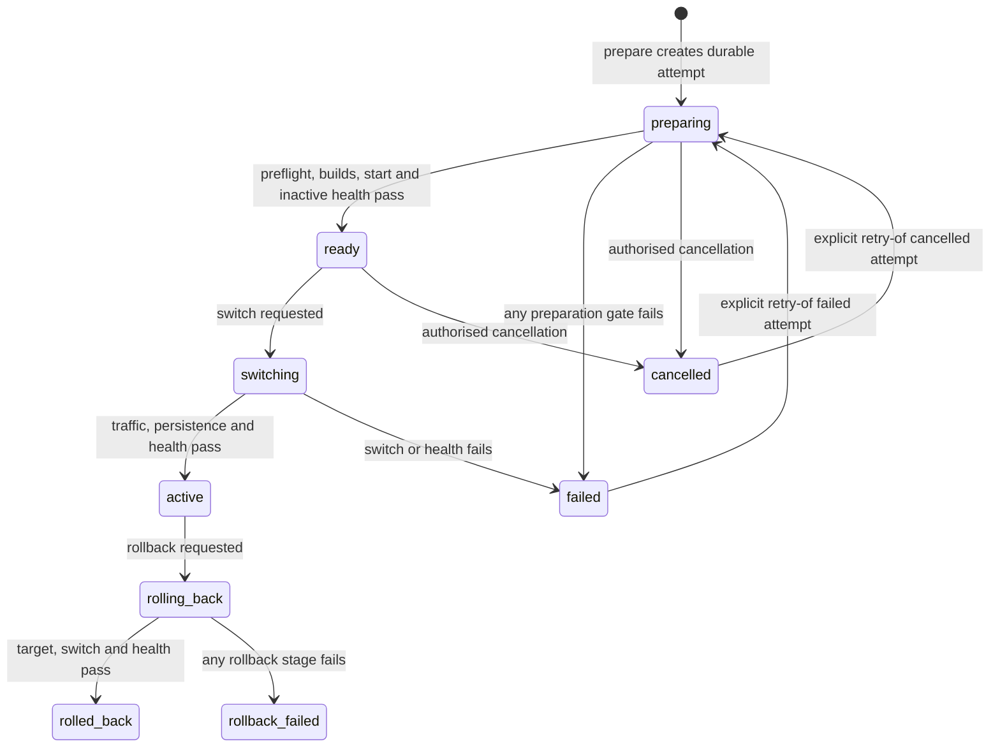

# Production release runbook

This is the authoritative entry point for releasing ScaleSmiths. Run repository-relative production commands from `/var/www/scalesmiths/ScaleSmiths`. The current production release path is the host-Nginx blue/green topology implemented by `scripts/release-manager.mjs` and `docker-compose.release.yml`. The detailed traffic-switch mechanics live in [Canary release and rollback](canary-release-and-rollback.md); that document is subordinate to this release policy.

CI, a successful image build, a prepared inactive slot, or a Forge release-gate result is evidence only. None independently authorises production deployment. A named human approver must authorise the exact commit and evidence set.

## Prerequisites and release identity

Before a release window:

1. Confirm the candidate is the reviewed `master` commit and record its full Git SHA, release ID, immutable image IDs/digests, operator, approver, window, observation period and rollback authority.
2. Confirm the checkout is `/var/www/scalesmiths/ScaleSmiths`, the root `.env` is protected, `generated-sites` is owned by UID/GID `1001`, the production Docker network name is verified, and host Nginx uses `/etc/nginx/scalesmiths/upstreams.conf`.
3. Confirm the current active and previous release IDs with `sudo -E node scripts/release-manager.mjs status`. A healthy retained previous slot is required for application rollback.
4. Complete the relevant items in [Production security checklist](production-security-checklist.md). For Forge-affecting releases, also complete the Forge gates below.
5. Freeze unrelated deployments and identify the incident channel. Do not release while another migration, backup/prune operation, restore, or catalogue mutation is in an uncertain state.

## Required CI and security gates

The pull request must pass every context in `scripts/branch-protection-policy.json`. The authoritative workflow definitions are `.github/workflows/ci.yml`, `.github/workflows/security.yml`, and `.github/workflows/codeql.yml`; [CI and security checks](ci-security.md) explains their coverage.

At minimum this includes the web/admin builds and tests, browser journeys, PostgreSQL integration and migration checks, backup/restore framework, Nginx topology, Forge E2E, root policy checks, Dependency Review, secret scanning, production npm audits, Dockerfile/image security, generated-site sandbox tests, and CodeQL where applicable. Confirm the checks belong to the exact candidate SHA. Never substitute an older successful run or a synthetic CI restore for production-derived evidence.

## Backup and database migration gate

Before any production migration:

1. Create and validate a fresh encrypted recovery bundle using [Production backup and restore](backup-and-restore.md). Confirm its off-host copy, retention, recovery-key ownership and identifier.
2. Confirm a recent isolated restore of production-derived data passed and was reviewed. Run the guarded forward verifier described in [Migration history integrity and backup verification](migration-history-and-backup-verification.md).
3. Review every new migration for compatibility with both the candidate and retained previous application. Applied SQL and journal history are immutable; corrections are new forward migrations.
4. Pause Forge workers and other writes when the reviewed migration plan requires it. Record both migration journals before and after.
5. Use the least-privilege tool services in this exact order:

   ```bash
   cd /var/www/scalesmiths/ScaleSmiths
   docker compose -f docker-compose.host-nginx.yml --profile tools run --rm postgres-provision
   docker compose -f docker-compose.host-nginx.yml --profile tools run --rm web-migrate
   docker compose -f docker-compose.host-nginx.yml --profile tools run --rm admin-migrate
   docker compose -f docker-compose.host-nginx.yml --profile tools run --rm postgres-provision
   ```

Stop on any unexpected journal, schema, ownership or grant result. The web history always precedes the admin history because both applications share PostgreSQL. Runtime containers must not receive the migration or provisioning credentials. See [PostgreSQL least-privilege rollout](postgresql-least-privilege-rollout.md).

## Prepare and release the canary

Export and verify the operational values required by the release manager as documented in [Canary release and rollback](canary-release-and-rollback.md). Set `RELEASE_ID` to the approved release identity, `INACTIVE_SLOT` to the verified inactive `blue` or `green` slot, and `RELEASE_OPERATOR` to the named operator. First inspect a mutation-free plan:

```bash
sudo -E node scripts/release-manager.mjs prepare \
  --release "$RELEASE_ID" \
  --slot "$INACTIVE_SLOT" \
  --actor "$RELEASE_OPERATOR" \
  --notes "approved change record" \
  --dry-run
```

Run the same `prepare` command without `--dry-run`. Preparation builds versioned web/admin images, starts only the inactive slot and requires both loopback health responses to report the expected release ID. Inspect bounded container logs and recheck the recorded SHA, image IDs, migration state, inactive ports and rollback compatibility.

Only after named approval, switch traffic through the release manager:

```bash
sudo -E node scripts/release-manager.mjs switch \
  --release "$RELEASE_ID" \
  --actor "$RELEASE_OPERATOR"
```

The tool rechecks health, atomically replaces the Nginx upstream include, runs `nginx -t`, reloads Nginx, restores the prior include if switching fails, records active/previous IDs, checks public health and appends the deployment log. Do not manually edit the upstream include unless the release manager is unavailable during an incident.

## Smoke verification and observation

After switching, verify and record:

- public and admin HTTPS health, release metadata and immutable image identity;
- public desktop/mobile navigation, assets, experience choice and quote/contact path using approved non-destructive data;
- admin login, MFA/session behaviour and an RBAC denial as well as an allowed read;
- portal account-to-client scoping without exposing another client's data;
- PostgreSQL connectivity, both migration journals, worker heartbeat, queue/retry state and absence of crash loops;
- host Nginx configuration/effective upstreams, bounded application/Nginx logs, error monitoring release SHA and alert delivery;
- Forge read-only access and provider/budget/sandbox health when Forge is affected.

Keep the previous slot and pre-release recovery point until the approved observation window closes. Do not automatically prune either.

## Failed release and application rollback

Treat failed prepare, failed switch, incorrect release identity, unhealthy service, auth/RBAC regression, data-integrity concern, worker malfunction, sustained error/latency breach, or loss of observability as a failed release. Stop further switches and migrations, pause new Forge work, preserve bounded logs/containers/workspace hashes, record database state, and notify the release or incident lead.

The release manager checkpoints `/var/lib/scalesmiths-release/releases/<release-id>.json` before and after every preflight, deployment, traffic-switch and health gate. The record contains the deployment and attempt IDs, retry lineage, actor, source commit and image tags, environment, timestamps, gate outcomes, failure category, bounded safe summary, rollback result, and previous/resulting active versions. A killed process therefore normally leaves a `preparing` record with `currentStage`; reconciliation is a human incident action, never an automatic success assumption.

Failed and cancelled operations append a matching event to `/var/lib/scalesmiths-release/deployments.jsonl`. Raw command output and exception text are deliberately excluded from both durable surfaces. Keep detailed diagnostics in the separately access-controlled log system and never paste credentials into `--notes`, `--reason`, release IDs, or source metadata.

Cancel a prepared release that will not be switched:

```bash
sudo -E node scripts/release-manager.mjs cancel \
  --release "$RELEASE_ID" \
  --actor "$RELEASE_OPERATOR" \
  --reason "change window closed"
```

A retry is the same release identity but a new attempt. It is permitted only from a failed or cancelled attempt and must name that exact attempt ID, for example `--retry-of "${RELEASE_ID}:1"`. Archived attempts remain under `/var/lib/scalesmiths-release/attempts/`; omitting retry lineage is rejected. Use a new release ID when the commit or artifact changes.

If the retained application is compatible with the current schema, validate it and run:

```bash
sudo -E node scripts/release-manager.mjs rollback --actor "$RELEASE_OPERATOR"
```

Then repeat smoke verification against the previous release and retain the release-manager log. Follow [Production incident response](incident-response.md) for evidence and closure.

## Database rollback limitations

The release manager rolls back application traffic only. It does not reverse migrations, restore PostgreSQL, restore environment files, or change generated workspaces. Never edit an applied migration, improvise a down migration, disable RLS, or point the guarded restore tooling at production.

If the previous application cannot safely use the migrated schema, do not switch it into service. Place the system in the approved maintenance/write-control state, take a fresh forensic backup where safe, restore the pre-release bundle into an explicitly confirmed isolated target, validate both journals and application compatibility, and obtain incident-lead approval for any production database replacement. The repository restore scripts deliberately restore only to guarded isolated targets; production replacement remains a separate human operation.

## Forge release considerations

For a release that changes Forge, generated sites, providers, budgets, sandboxing, workers or deployment candidates:

- retain `FORGE_ENABLE_AI=false` unless live providers and spend controls have explicit approval;
- require Docker sandbox execution in production and keep previews private;
- pause new Forge work around incompatible schema/application states without discarding queued evidence;
- confirm worker heartbeat, leases, queue depth, retries, budgets and provider health without unnecessary billable calls;
- require deployment-candidate provenance, dependency admission, workspace/lockfile hashes, SBOM and release gates for generated-site deployment;
- complete [Forge V2 production validation](forge-v2-production-validation.md) when its scope applies.

The dated [Forge V2 release-readiness ledger](../release-readiness/forge-v2.md) is historical release evidence and may remain blocked. It is not a standing authorisation for a later SHA.

Forge's existing Deployment panel is the natural admin status surface for generated-site candidates: it shows immutable candidate identity, commit/workspace hashes, dependency/SBOM evidence and server-evaluated gate outcomes. The Forge deployment agent currently prepares instructions and records manual readiness/deployed acknowledgements; it does not execute the host release manager. Do not present those acknowledgements as host deployment success. Correlate them to the host release/deployment ID in the approved change record.

## Release state machine



`failed`, `cancelled`, `rolled_back`, and `rollback_failed` are operationally terminal outcomes. A retry creates a distinguishable attempt and never rewrites the archived terminal record.

## Emergency procedure

Use the normal reviewed release or rollback path whenever it can contain the incident safely. If it cannot:

1. Declare an incident, name the incident lead and freeze unrelated deployments, migrations and Forge execution.
2. Preserve the current release IDs, image digests, Nginx state, migration journals and bounded redacted logs.
3. Prefer the release manager's validated rollback. If it is unavailable, make only the smallest reviewed host change needed to restore service and record every command and actor.
4. Do not bypass database restore guards or improvise schema rollback. Rotate credentials only when exposure is suspected or confirmed.
5. Complete skipped checks, peer review and a retrospective incident record immediately after containment.

Emergency administrator branch bypass is governed separately by [Protected areas and branch protection](protected-areas-and-branch-protection.md); it does not bypass production approval, backup, data-safety or evidence requirements.

## Release evidence and closure

Record the exact SHA, image identities, CI run links, backup/restore identifiers, migration journals, operators/approver, release-manager log entry, smoke results, observation window, rollback decision and residual risk. Store dated evidence under `docs/releases/` only when it is suitable for source control and contains no secrets or client data. Dated reports are snapshots, not the current process; this runbook and executable repository configuration take precedence.
