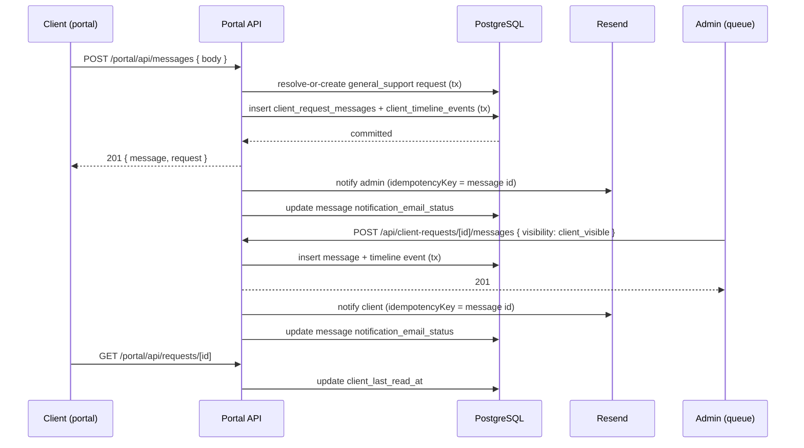

# Portal messaging: replace mailto composer with persisted threads

## Problem

The client portal's "Direct project message" composer (`web/src/components/portal/PortalMessageComposer.tsx`) builds a `mailto:hello@scalesmiths.co.uk` link and hands the browser off to the visitor's local mail client. Nothing is stored: ScaleSmiths has no record of what was sent unless the email arrives and is kept, the client has no in-portal history, there is no authenticated scoping, no rate limiting, and no notification back to the client that a reply exists. The portal's `MessagesTab` also shows a static "message history will appear here once the workspace is connected to live project updates" placeholder that was never wired to anything.

Separately, the existing client-request system (`client_requests` / `client_request_messages` / `client_timeline_events`) already implements almost everything a persisted message thread needs: authenticated scoping, sender identity, `client_visible`/`internal` visibility, timestamps, a portal thread UI (`PortalRequestThread`), and a full admin thread UI (`ClientRequestsQueue`). It notifies staff by email on request creation (`sendClientRequestNotifications`), stores notification outcome (`notification_email_status`/`notification_email_failure_reason`) without ever losing the underlying row, and rate-limits creation (`portalRequestCreate`). It does **not** yet notify anyone on a *reply* to an existing thread in either direction, and a rate-limit policy for replies (`portalRequestMessage`) is already declared but never wired up.

## Goals

- Replace the mailto composer with a real, DB-backed conversation between a client and ScaleSmiths.
- Reuse the client-request infrastructure rather than building a parallel messaging system.
- Close the two live gaps in that infrastructure (no notification on reply either direction; unused rate-limit policy) as part of this work, since the new composer depends on both.
- Add read-state, auditability, idempotent notification delivery, and header-injection safety, all scoped to what the requirements actually ask for.

## Non-goals

- A generic issue tracker or dependency graph (matches the existing delivery-domain "deliberate first-version limits" philosophy).
- Real-time push (websockets/polling) — the portal already reloads thread state via `fetch` after an action; that pattern is kept.
- A dedicated messaging table separate from `client_requests` — rejected in favor of reuse (see Approach below).

## Approach

Every general portal message becomes a `client_requests` row with `category = "general_support"`. The composer resolves-or-creates **one ongoing thread per client**: if the client already has a non-terminal (`status not in ("completed","cancelled")`) `general_support` request, the message is appended to it via the existing per-request message path; otherwise one is created (title `"Portal messages"`, priority `medium`, status `new`) in the same transaction as the first message. The client therefore sees one continuous conversation, not a new ticket per message, while ScaleSmiths sees it in the same admin queue as every other request.

This was chosen over a dedicated `portal_messages` table because it reuses 90% of already-correct, already-tested machinery (auth scoping, visibility, admin UI, rate limiting, DB-first notification pattern) instead of duplicating it, and because "reuse client-request infrastructure where semantically appropriate" was explicit in the request. The trade-off is that a `general_support` request behaves like any other request in the admin queue (it has a status field that doesn't map perfectly to "just a conversation"), which is judged acceptable: admins already triage a mixed queue and can leave general threads at `status="new"`/`"in_progress"` indefinitely without a completion deadline forcing anything.

## Data model changes

Two migrations, no new tables:

```sql
alter table client_request_messages
  add column notification_email_status text,
  add column notification_email_failure_reason text;

alter table client_requests
  add column client_last_read_at timestamptz,
  add column admin_last_read_at timestamptz;
```

- `client_request_messages.notification_email_status`/`...failure_reason` mirror the existing pattern on `client_requests`, giving every message (not just the request-creation message) an auditable notification outcome, and doubling as the idempotency anchor (see below).
- `client_requests.client_last_read_at`/`admin_last_read_at` are nullable timestamps updated when each side actually opens the thread. "Unread" is derived by comparing the other side's message `createdAt` values against the viewer's own `*_last_read_at` — no read-receipts table required. Both apply to every `client_requests` row (formal requests and general threads alike), since the columns are generically useful and a request already has exactly one client and one admin-side viewer concept.

## Message flow



Endpoints:

- **`POST /portal/api/messages { body }`** (new) — the composer's only endpoint. Resolves-or-creates the client's general thread, inserts the message + timeline event in one transaction, returns the request + message, then best-effort notifies admin. Rate-limited on `portalRequestMessage` (IP + `session.clientId`).
- **`POST /portal/api/requests/[id]`** (existing, client reply on any thread) — gains the `portalRequestMessage` rate limit (policy already declared, never wired up) and a best-effort admin notification after commit.
- **`POST /api/client-requests/[id]/messages`** (existing, admin reply) — gains a best-effort client notification after commit, only when `visibility === "client_visible"` (internal notes never notify the client — they're not visible to them).
- **`GET /portal/api/requests/[id]`** (existing) — stamps `client_last_read_at = now()`.
- Admin: opening/selecting a request in `ClientRequestsQueue` calls a small new endpoint to stamp `admin_last_read_at`.

All three insert-then-notify sequences follow the pattern already proven in `POST /portal/api/requests`: the DB transaction commits first; the notification attempt is wrapped in try/catch that can never undo or block on the write. A failed notification is recorded on the message row and surfaced to admins as an operational signal, but the message itself is never lost.

## Notifications

- **New module** `admin/src/lib/server/client-request-notifications.ts`, structurally mirroring `web/src/lib/request-notifications.ts` (config resolution from `RESEND_API_KEY`/`RESEND_FROM`, HTML+text builders, `escapeHtml`). It resolves the client's notification email via `clients.contactEmail` joined on `clients.portal_client_id = client_requests.client_id` — the same join key the delivery-projects portal projection already uses, so no new cross-domain table access is introduced.
- **Idempotency**: every `resend.emails.send()` call passes `{ idempotencyKey: "client-request-message-" + messageId }`, the exact convention already used in `admin/src/lib/server/invoice-delivery.ts` (`"invoice-delivery-" + attempt.id`). This is applied to the *existing* `sendClientRequestNotifications` call too (currently missing a key), and to the two new notification call sites. A retried notification attempt for the same message can never double-send.
- **Header injection**: a new `sanitizeHeaderValue()` helper (strips CR, LF, NUL) is applied everywhere a user-controlled string reaches a subject line or `replyTo` — the request title (client-controlled, already length-capped at 180) and the client's stored email. Applied retroactively to `web/src/lib/request-notifications.ts`'s existing subject builders, which have the same latent gap today. Message bodies never touch a header — they only ever appear in the HTML/text body, which is already `escapeHtml`'d.

## Portal UI

- `PortalMessageComposer.tsx`: replaced with a client component posting to `/portal/api/messages`, showing send/error/success state (same visual language as `PortalRequestThread`'s existing form). On success it shows the thread inline via a generalized `PortalRequestThread` (prop-compatible; no behavior change for the request-thread use case).
- `MessagesTab` in `web/src/app/portal/[clientId]/page.tsx`: the static "message history will appear here" placeholder is removed. The tab server-loads the client's general thread (if any) via a new `getPortalGeneralMessageThread(portalClientId)` in `portal-client-requests.ts` and renders it with the composer + thread, or an empty state ("No messages yet — send one below") if none exists yet.
- Rendering stays on React text interpolation throughout (no `dangerouslySetInnerHTML` anywhere in this path) — XSS-safe by construction, unchanged from the existing request-thread rendering.

## Admin UI

No new surface. A `general_support` request appears in `ClientRequestsQueue` like any other request; the existing reply box, internal-note box, and status controls all apply unchanged. Selecting a request stamps `admin_last_read_at`.

## Fallback

A `mailto:hello@scalesmiths.co.uk` link is retained but demoted to visible fallback only: shown when the `POST /portal/api/messages` call fails outright (network error or 5xx), with copy making clear it's a backup route. It is never the default action.

## Testing

- **Unit**: rate limit wiring on `/portal/api/requests/[id]` and `/portal/api/messages`; `sanitizeHeaderValue`; resolve-or-create-thread logic (new thread vs. append to existing non-terminal one); idempotency key construction; read-state stamping.
- **Portal authorization test** (matching the existing source-scan convention in `portal-project-boundaries.test.ts`/`portal-invoices.test.ts`): the general-thread query scopes by `session.clientId`, never trusts a client-supplied id, and never selects `internalNotes`/internal-only fields into the portal DTO.
- **E2E** (`web/tests/e2e/portal-messaging.spec.ts`, gated on `DEMO_PORTAL_ENABLED` like `portal-board.spec.ts`): unauthenticated redirect; send a message via the composer and see it appear in the thread; empty-state before any message exists; no `mailto:` link present in the default (working) path.

## Removed scaffolding

`PortalMessageComposer.tsx`'s mailto-building `useMemo`/`href` logic and the static message-history placeholder in `MessagesTab` are deleted, not left dead behind a flag. The mailto link that remains is the explicit fallback described above, not leftover scaffolding.
